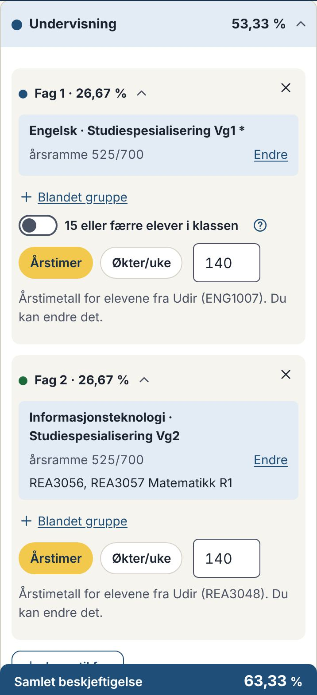
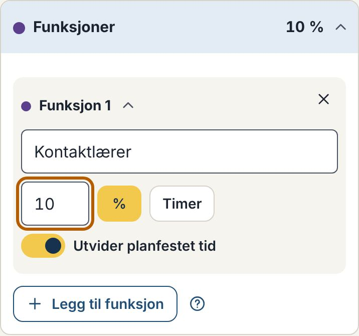
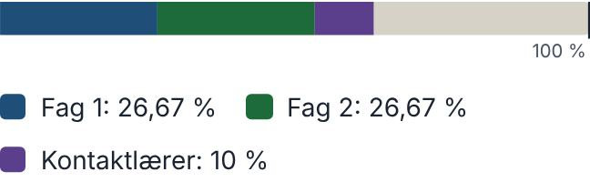
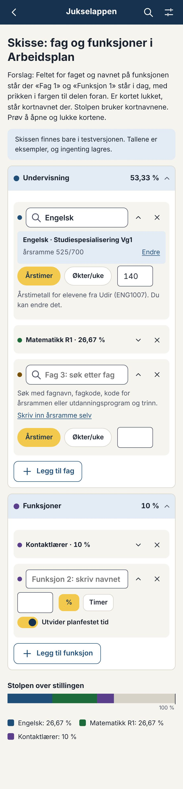
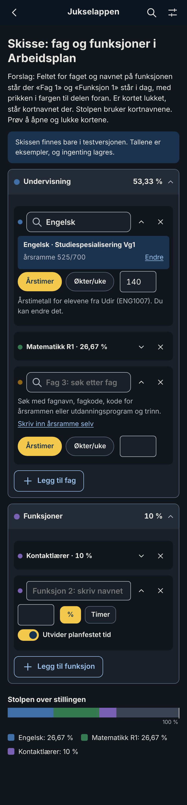
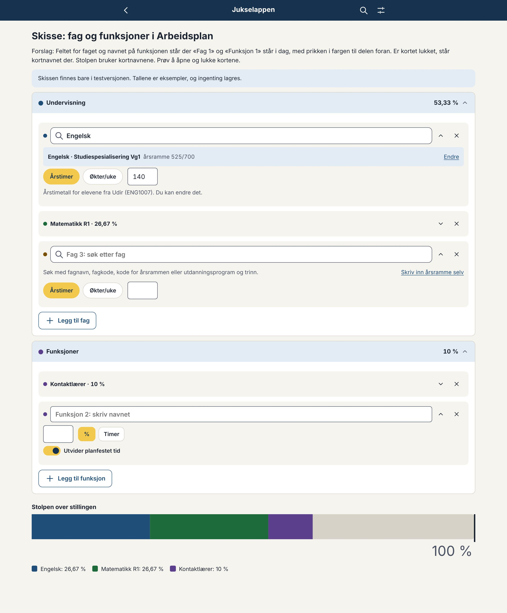

# Forslag: fag og funksjoner i Arbeidsplan

Til eier, 09.10.2026. Svar gjerne punkt for punkt (f.eks. «A1 ja, A2 B»).

## Runde 1: skisse og fem spørsmål (09.10.2026)

**Ønsket ditt:** I Undervisning står det i dag «Undervisning», så «Fag 1» og så «Fag». Det blir mange nivåer. Feltet for faget skal stå der «Fag 1» står, med en tekst i feltet som veileder før det er fylt ut. Når kortet er lukket, står kortnavnet til faget der. Den fargede prikken blir stående. Stolpen over stillingen bruker kortnavnene i stedet for «Fag 1», «Fag 2» og så videre. Det samme for funksjonene.

Skissen finnes bare i testversjonen: https://jukselappen.no/test/#/utvikling/arbeidsplan-fag. Kortene kan åpnes og lukkes, og feltene kan fylles ut, men skissen regner ingenting og lagrer ingenting. Arbeidsplan selv er uendret.

### I dag

| Undervisning | Funksjoner | Stolpen |
|---|---|---|
|  |  |  |

### Forslaget

| Mobil | Mørk visning | Skrivebord |
|---|---|---|
|  |  |  |

**Kortet for et fag:**
- **Øverst:** prikken i fargen til faget, så søkefeltet der «Fag 1» står i dag, og pilen og krysset til høyre.
- **Før noe er valgt:** «Fag 3: søk etter fag» står grått i feltet. Under står en kort hjelp og «Skriv inn årsramme selv», som står ved etiketten «Fag» i dag. Etiketten og spørsmålstegnet er tatt bort, og hjelpen står i stedet under feltet.
- **Når et fag er valgt:** fagets kortnavn står i feltet. Under står årsrammen som før, med «Endre». Kortnavnet er faget, og boksen under er årsrammen. Med Matematikk R1 står det for eksempel «Matematikk R1» i feltet og «Informasjonsteknologi · Studiespesialisering Vg2» i boksen.
- **Lukket:** «Matematikk R1 · 26,67 %», med prikken foran. Et trykk på navnet eller pilen åpner kortet.

**Kortet for en funksjon:** Navnefeltet står øverst, med «Funksjon 2: skriv navnet» grått før det er fylt ut. Lukket står det «Kontaktlærer · 10 %».

**Stolpen:** «Engelsk: 26,67 %», «Matematikk R1: 26,67 %» og «Kontaktlærer: 10 %», i stedet for «Fag 1» og «Fag 2». Funksjonene har navnet sitt i stolpen allerede i dag.

### A1. Kortnavnet

Grep har ikke egne kortnavn for fagene. Forslaget er dette:
- Kortnavnet er navnet på faget: fra fagkoden når faget er valgt med fagkode (Matematikk R1), ellers fra årsrammeraden (Engelsk). Utdanningsprogram og trinn står ikke med.
- Kortnavnet har høyst tre ord. Har navnet flere, står de tre første ordene og «…».
- Med egen årsramme er kortnavnet «Egen årsramme 120».
- Før noe er valgt, står «Fag 1».
- Har to fag samme kortnavn, får det andre et nummer: «Engelsk (2)».

**Råd:** Som over.

### A2. Krysset

Krysset som tar bort kortet, står til høyre for pilen på samme linje, som i dag. På mobil blir feltet da litt smalere.

- **A:** som i skissen
- **B:** krysset blir en lenke nederst i kortet, «Fjern faget», så feltet får hele bredden

**Råd:** A. Det er likt for fag og funksjoner og som i dag, og feltet er bredt nok til kortnavnene.

### A3. Hvor kortnavnet brukes

«Fag 1» står i dag også i utregningen («Fag 1: …»), i kalkulatoren Beskjeftigelse og i sammenligningen av to arbeidsplaner.

**Råd:** Kortnavnet alle steder der «Fag 1» står i dag, så det er det samme navnet overalt.

### A4. Beskjeftigelse

Kalkulatoren Beskjeftigelse har de samme fagkortene.

**Råd:** Samme endring der, så kortene er like i begge kalkulatorene.

### A5. Skrivebord

I skissen går kortene over hele bredden. I Arbeidsplan står skjemaet i venstre kolonne på skrivebord, så feltet blir like bredt som søkefeltet i dag.

**Spørsmål:** Ser dette greit ut, eller vil du se det i Arbeidsplan selv før du bestemmer deg?

### Videre

Når du har svart, bygger jeg endringen i Arbeidsplan (og Beskjeftigelse), med tester, og fjerner skissen. Endringen kan komme i en ny versjon, for eksempel 1.1.0.
