# Forslag: fase 10 – Velkomst

Til eier, 08.10.2026. Svar gjerne punkt for punkt (f.eks. «V1 ja, V3 B»). Rundene står med den nyeste øverst.

---

## Runde 1: skisse og åtte spørsmål (08.10.2026)

Skissen finnes bare i testversjonen (https://jukselappen.no/test/). Den publiserte appen er uendret. Velkomsten virker som den skal i appen: valgene lagres, og favorittene, fylket og jukselappen blir med videre.

- **Første besøk:** Testversjonen har egen lagring (avgjørelse 045). Har du ikke brukt testversjonen på enheten før, åpnes velkomsten av seg selv på forsiden.
- **Åpne den igjen:** «Ny her? Se velkomsten» nederst på forsiden, eller raden «Velkomst» nederst i Innstillinger, over «Om appen».
- **Et bestemt trinn:** `#/?vis=velkomst&trinn=rolle` (trinnene heter `velkommen`, `forsiden`, `sidene`, `sted`, `rolle`, `jukselapp`, `installer` og `takk`).

### Slik ser det ut

| | Mobil | Skrivebord |
|---|---|---|
| 1. Velkommen | 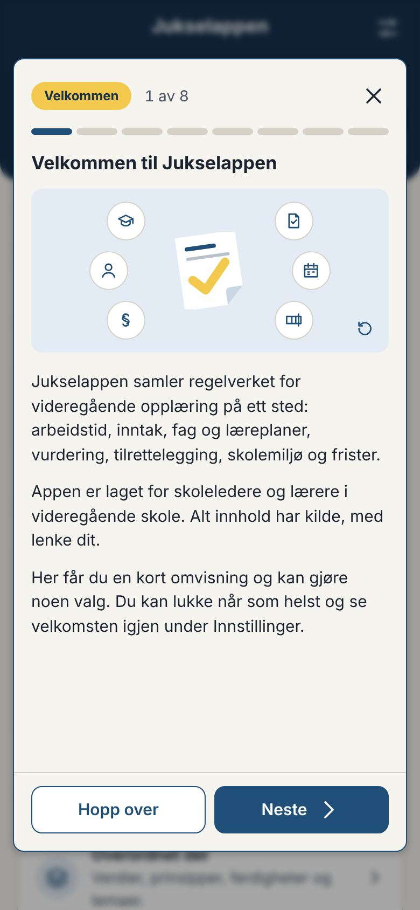 | 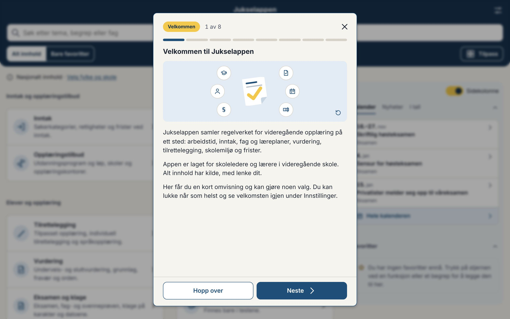 |
| 2. Forsiden og søket | 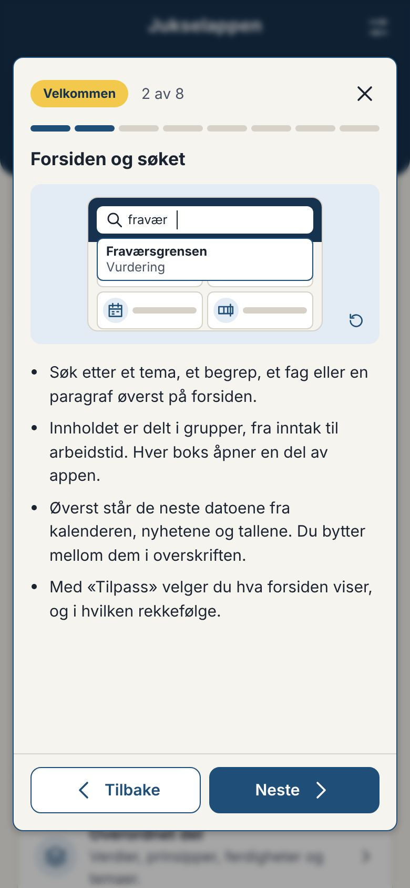 | |
| 3. Sidene | 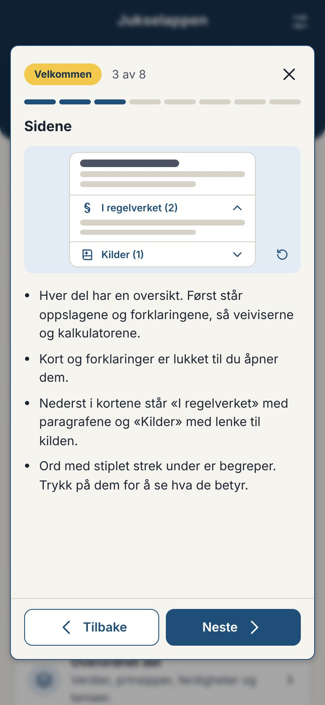 | |
| 4. Fylke og skole, med lokale regler | 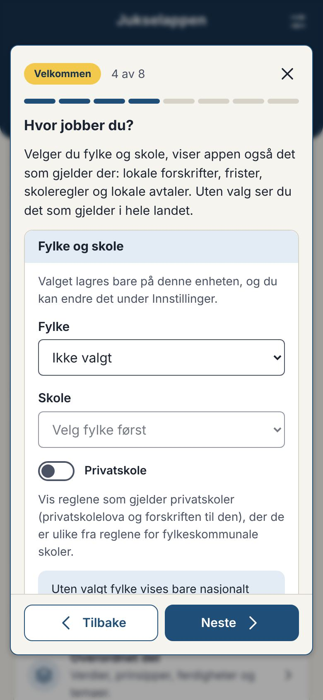 | |
| 5. Rolle og favoritter (kontaktlærer valgt) | 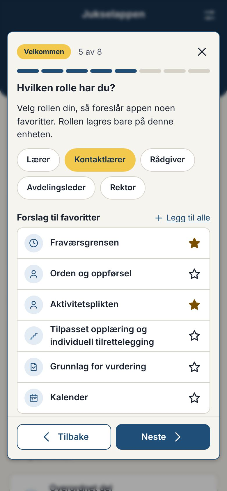 | 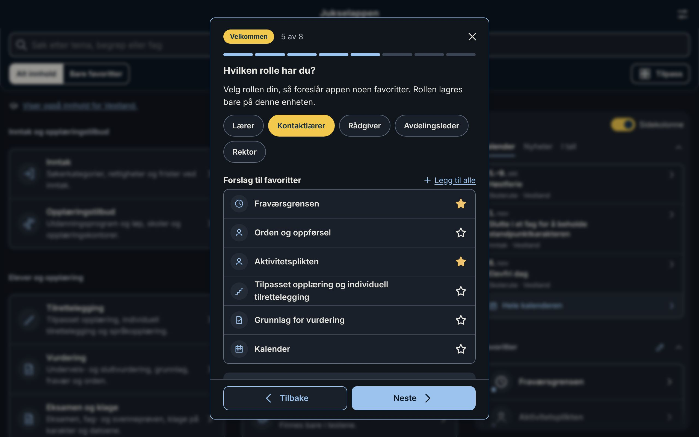 |
| 6. Dagens jukselapp | 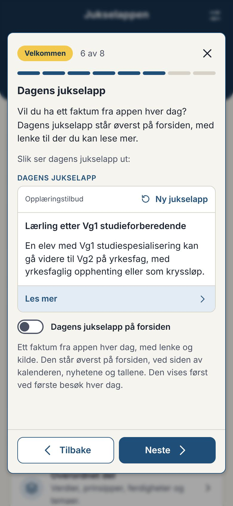 | |
| 7. Installere (mørk visning) | 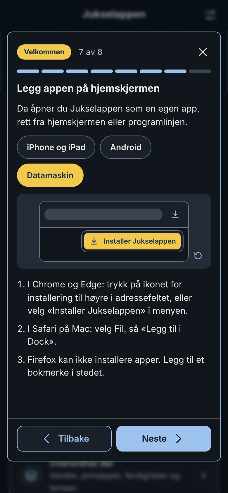 | |
| 8. Du er klar! | 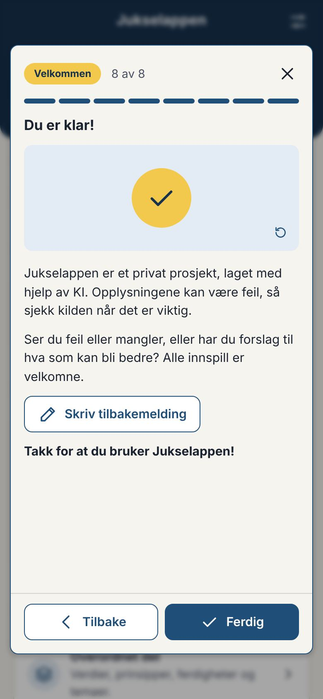 | |
| 320 px, nynorsk | 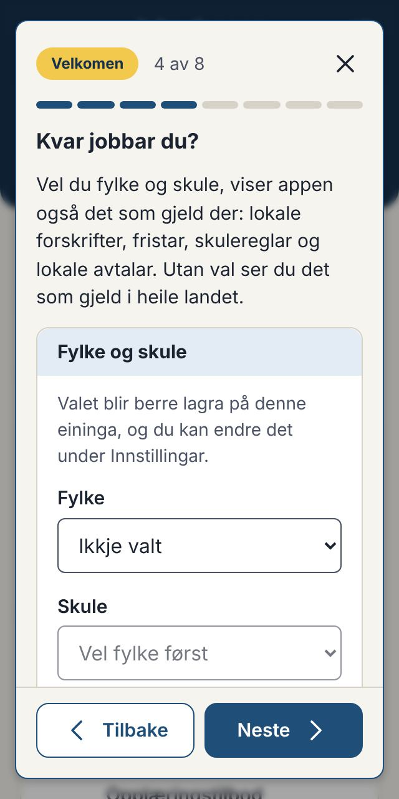 | |

Skjermbildene er tatt etter at animasjonene er ferdige. Bildet av installasjonen viser «Datamaskin», fordi nettleseren i skymiljøet sier at den er en datamaskin. På en iPhone står «iPhone og iPad» valgt fra start.

**Vinduet** bygger på `Overlegg` fra meldingen om ny versjon: kortet midt på skjermen over et uklart slør, tynn ramme i merkefargen. Øverst står merkelappen «Velkommen», «3 av 8», krysset som lukker, og en stolpe med trinnene, som fasestolpen i veiviserne. Vinduet har fast høyde, så «Tilbake» og «Neste» står på samme sted i alle trinnene, og bare innholdet ruller. Ved første trinn står «Hopp over» i stedet for «Tilbake». Esc lukker. En lenke i vinduet (f.eks. til skjemaet for lokale regler) lukker vinduet og åpner siden.

**Valgene** er de samme som i Innstillinger: fylke og skole er den samme delen (koden er flyttet til `StedValg`, så de ikke kan bli ulike), rollen er gule piller, og dagens jukselapp er den samme bryteren.

**Lasting:** Velkomsten, stilene, tekstene og animasjonene lastes først når vinduet åpnes (6 kB og 2 kB gzip). Startpakken er 130,5 kB, som før.

### V1. Brukere som har appen fra før

Velkomsten åpnes av seg selv bare når ingenting er lagret på enheten, altså ved første besøk. De som har appen fra før, har lagrede data.

- **A:** De får velkomsten én gang, når versjonen kommer.
- **B:** De får den ikke av seg selv. Meldingen om ny versjon har et punkt om velkomsten og en knapp «Se velkomsten».
- **C:** Som B, men uten knapp. De finner den på forsiden og i Innstillinger.

**Råd:** B. Meldingen om ny versjon kommer uansett, og to vinduer etter hverandre blir mye. Med knappen er velkomsten ett trykk unna for den som vil se den.

### V2. Rollene og favorittene

Rollen er ett valg (gule piller). Rollen gir seks forslag. Hver har en stjerne, og «Legg til alle» legger til alle. Ingen favoritter legges til før brukeren trykker. Rollen lagres bare på enheten (`innstillinger.rolle`).

| Rolle | Foreslåtte favoritter |
|---|---|
| Lærer | Underveis- og sluttvurdering, Grunnlag for vurdering, Fraværsgrensen, Tilpasset opplæring og individuell tilrettelegging, Eksamen, Arbeidsplan |
| Kontaktlærer | Fraværsgrensen, Orden og oppførsel, Aktivitetsplikten, Tilpasset opplæring og individuell tilrettelegging, Grunnlag for vurdering, Kalender |
| Rådgiver | Rett, inntak og søknad, Poengberegning, Kalender for inntak, Opplæringsløp, Lærlinger og kandidater, Særskilt språkopplæring og kort botid |
| Avdelingsleder | Arbeidsplan, Beskjeftigelse, Vikartimer, Grunnlag for vurdering, Klage på karakter, Aktivitetsplikten |
| Rektor | Et trygt og godt skolemiljø, Aktivitetsplikten, Arbeidsplan, Klage på karakter, Elevundersøkelsen, Videregående i tall |

En test sjekker at alle favorittene finnes i appen.

**Spørsmål:** Er rollene og favorittene riktige? Skal det være flere roller, f.eks. «Eksamensansvarlig», «Spesialpedagog» eller «Annet»?

**Råd:** De fem rollene, ett valg. En kontaktlærer er også lærer, men får forslagene som er mest typiske for kontaktlæreren.

### V3. Rollen og kalenderen

Filteret «Hvem det gjelder» i kalenderen gjelder elevgruppene: elever, privatister, lærlinger, voksne og fortrinnsrett. Det passer ikke med rollene til de ansatte. En rådgiver trenger f.eks. både elever, privatister og voksne.

- **A:** Rollen setter ikke filteret.
- **B:** Rollen velger temaet i kalenderen i stedet, f.eks. inntak for rådgiveren og eksamen for avdelingslederen.

**Råd:** A. Kalenderen viser alt fra start, og et filter brukeren ikke har valgt selv, kan gjøre at en frist blir oversett.

### V4. Oppbyggingen: to trinn

- **«Forsiden og søket»:** søket, gruppene og boksene, kalenderen, nyhetene og tallene øverst, og «Tilpass». Bildet viser et ord som skrives i søket, og treffet som kommer fram.
- **«Sidene»:** oversikten i hver del, kortene og forklaringene som er lukket, «I regelverket» og «Kilder», og begrepene med stiplet strek. Bildet viser et kort der raden «I regelverket» åpnes.

**Råd:** To trinn. Favorittene vises i trinnet om rollen, der de kan legges til.

### V5. Lokale regler

I skissen står lokale regler nederst i trinnet om fylke og skole: «Mangler en lokal regel?», en linje om hvordan det virker og lenken «Legg inn en lokal regel». Da blir det åtte trinn.

- **A:** Som i skissen, i trinnet om fylke og skole.
- **B:** Eget trinn, med samme tekst og lenke. Da blir det ni trinn.

**Råd:** A. Lokale regler henger sammen med fylket og skolen, og færre trinn gjør at flere kommer gjennom hele.

### V6. Dagens jukselapp

Trinnet viser dagens jukselapp slik den står på forsiden i dag, med «Ny jukselapp», og bryteren under. Brukeren ser hva hen sier ja til, med ekte innhold fra appen.

**Råd:** Som i skissen.

### V7. Tekstene og animasjonene

Tekstene står i skjermbildene og i `src/strings/velkomst.nb.ts` og `velkomst.nn.ts`. Les gjerne særlig:

- **Trinn 1:** «Appen er laget for skoleledere og lærere i videregående skole. Alt innhold har kilde, med lenke dit.»
- **Trinn 8:** «Jukselappen er et privat prosjekt, laget med hjelp av KI. Opplysningene kan være feil, så sjekk kilden når det er viktig.» Knappen «Skriv tilbakemelding» lager den samme e-posten som Tilbakemelding i Innstillinger (avgjørelse 064).

**Animasjonene** er laget i HTML og CSS i appens farger, så de følger lys og mørk visning:

1. Logoen, og ikonene for delene av appen som kommer fram rundt den.
2. Et ord skrives i søket, og treffet kommer fram.
3. Raden «I regelverket» åpnes i et kort.
4. Ingen animasjon. Valgene er innholdet.
5. Stjernen ved en sidetittel fylles, og siden kommer med under favorittene.
6. Ingen animasjon. Dagens jukselapp vises.
7. Knappen for å installere lyser opp, og menyvalget kommer fram, for iPhone og iPad, Android eller datamaskin.
8. En hake i en gul sirkel.

Hver animasjon går én gang og er ferdig innen tre sekunder (WCAG 2.2.2 krever stopp innen fem). Knappen i hjørnet av bildet spiller den av igjen. Med redusert bevegelse på enheten står bildet stille, uten knappen.

**Spørsmål:** Er tekstene og bildene greie? Er noe for mye eller for lite?

### V8. Installasjon

Trinnet velger enheten selv (iPhone og iPad, Android eller datamaskin), og brukeren kan bytte. Det viser stegene for enheten. I Chrome og Edge, der nettleseren lar appen tilby installasjon, står knappen «Installer appen» i stedet for stegene. Trinnet hoppes over når appen alt er installert.

**Råd:** Som i skissen.

### Også rettet

- **Innstillinger, «Fylke og skole»:** Teksten om skolelisten sto tett inntil knappen «Fjern fylke og skole». En knapp midt i et kort i Innstillinger har nå like mye luft under seg som over.
- **Overskriftene over verktøyene på oversiktene:** «Veiviser» og «Kalkulator» når det er én, «Veivisere» når det er flere. Inntak, Skolemiljø og Vurdering har én veiviser, Tilrettelegging har to. Overskriften følger antallet av seg selv, også når en veiviser bare finnes for et fylke.

### Videre

Når du har svart og er fornøyd med designet, bygger jeg det ferdig: meldingen til dem som har appen fra før (V1), det du vil endre, ende-til-ende-testene (overflyt og axe i lys og mørk, også for vinduet) og avgjørelsesnotatet. Så versjons-PR-en.
