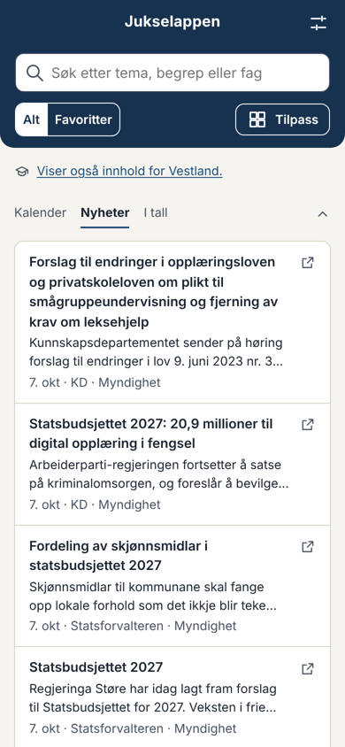
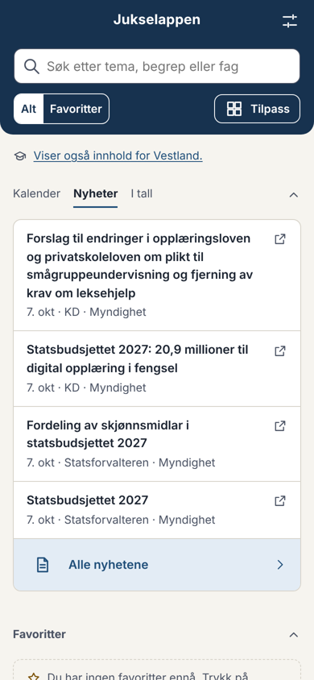
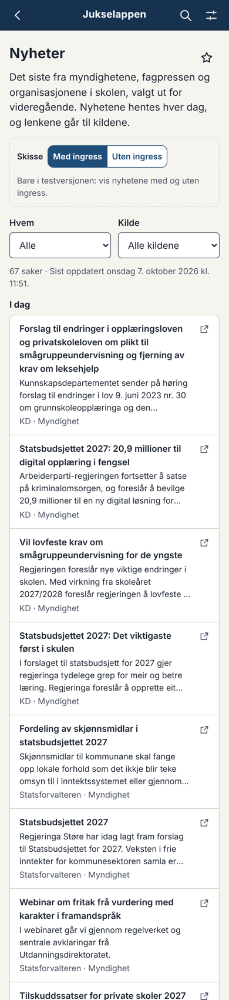
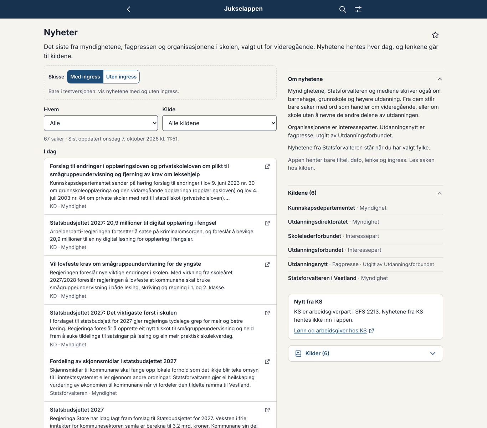
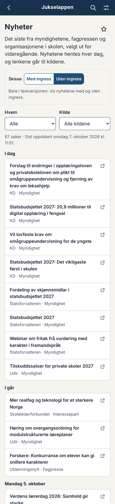
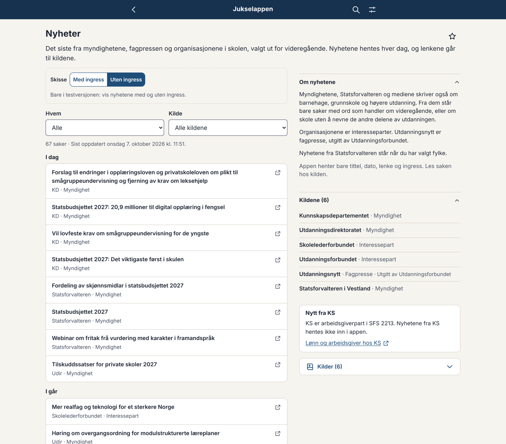

# Fase 7b – forslag 1: nyhetene, kildene og designet

Til eier, 07.10.2026. Svar gjerne punkt for punkt (f.eks. «D1 med ingress, K3 ja»). Skissen ligger i testversjonen: https://jukselappen.no/test/ (forsiden → «Nyheter» i panelet, og Oppslag → Nyheter).

Sakene i skissen er ekte, hentet 07.10.2026 fra 15 kilder (81 saker de siste 90 dagene). Ingenting er publisert i appen, og arbeidsflyten som henter hver dag, lages først når du har svart på avgjørelse 084.

---

## Gjort før nyhetene: nynorsk lastes bare når den trengs

Startpakken var 149,4 kB (grense 150 kB). Nå lastes bare tekstene for målformen brukeren har valgt, og den andre når brukeren bytter. Startpakken er 120,2 kB med nyhetene og den største tekstfilen regnet med. Flettet i PR #120 (avgjørelse 083).

---

## D. Designet

**Forsiden** (visningen «Nyheter» i panelet, avgjørelse 081): de fire nyeste sakene, høyst to fra hver kilde, så én kilde med mange saker samme dag ikke fyller panelet. Under tittelen: dato, kilde og hvem som står bak («7. okt · KD · Myndighet»). Lukket viser overskriften den nyeste saken. «Alle nyhetene» nederst, som «Hele kalenderen».

**Nyhetssiden** (Oppslag → Nyheter, `#/nyheter`): sakene per dag («I dag», «I går», «Mandag 5. oktober»), filter på hvem (myndigheter, fagpresse, organisasjoner) og kilde, og filteret i adressen. Til høyre på skrivebord: «Om nyhetene», kildene med status, en fast boks «Nytt fra KS» og kildene til siden. Hver sak er en lenke ut, med ikon for at den åpnes hos kilden.

| | Mobil | Skrivebord |
|---|---|---|
| Forsiden med ingress |  |  (uten ingress) |
| Forsiden uten ingress |  | |
| Siden med ingress |  |  |
| Siden uten ingress |  |  |

I testversjonen står en bryter «Med ingress / Uten ingress» øverst på nyhetssiden. Den gjelder også forsiden.

**Spørsmål:**
- **D1. Ingress:** med, uten, eller med på siden og uten på forsiden? Mitt råd: uten på forsiden (fire titler får plass uten å rulle), med på siden (høyst tre linjer).
- **D2. Ingress fra hvem:** alle, eller bare myndighetene (NLOD)? Organisasjonene, Utdanningsnytt og Statsforvalteren oppgir ingen lisens. Ingressen er deres eget sammendrag, og vi lenker alltid til saken. Mitt råd: alle, så listen ser lik ut, men du avgjør.
- **D3. Merket «Myndighet»** står ved alle saker fra KD, Udir og Statsforvalteren. Skal bare interesseparter og fagpresse ha merke, så listen blir roligere?
- **D4. Hvor langt tilbake:** 90 dager og høyst 25 saker per kilde. Siden blir lang (67 saker med Vestland valgt). Skal den vise de siste 30 dagene, med «Vis eldre» under?

---

## K. Kildene

Kriteriene fra arbeidsordren: feed, eller liste på én side med tittel, dato og lenke (én forespørsel per henting); robots.txt tillater stien; ingen innlogging; relevant for videregående. Ingen skraping av hver sak.

**I skissen nå (15 kilder):**

| Kilde | Type | Hvordan | Filter | Saker i dag (med / i feeden) | Vurdering |
|---|---|---|---|---|---|
| Kunnskapsdepartementet | Myndighet | RSS | ord | 10 / 100 | Ta med. NLOD. |
| Udir | Myndighet | liste, én side | ord | 5 / 10 | Ta med. NLOD. Bare ti saker per side, så den må hentes hver dag. |
| Statsforvalteren (10 embeter) | Myndighet | RSS per embete | ord + fylke | 0–6 / 50 | Ta med, vises bare når fylket er valgt. Feeden har bare datoen saken sist ble endret; skriptet beholder den første datoen det så. |
| Utdanningsnytt (taggen videregående) | Fagpresse, utgitt av Utdanningsforbundet | RSS | ingen | 36 / 133 | Ta med. robots tillater alt. Om lag tre saker i uka. |
| Skolelederforbundet | Interessepart | RSS | ingen, medlemstilbud tas bort | 9 / 10 | Ta med. |
| Utdanningsforbundet | Interessepart | liste, én side | ingen | 12 / 12 | **K1:** Du må si ja, fordi det er en liste og ikke en feed. robots tillater stien, men har `ai-train=no` og stenger KI-roboter. Vi henter med vår egen User-Agent og bruker ikke teksten til trening, men du bør vite det. |

**Fra arbeidsordren, ikke med ennå:**
- **Skolenes landsforbund** (WordPress `/feed/`): stengt fra skymiljøet. Prøves i første kjøring i Actions.
- **Lovdata (Lovtidend):** Endringene står allerede i Kalender. **K2:** Skal de også stå i nyhetene? Lovdata har RSS for Lovtidend, men den kunne ikke prøves herfra (Lovdata svarte 405).
- **KS og KF Infoserie:** ikke hentet, som rådet i arbeidsordren. Siden har en fast lenke «Nytt fra KS» til ks.no. **K9:** Skal jeg skrive et utkast til e-posten til KS og Kommuneforlaget (punkt 1 i rådet)?

**Nye kilder du ba meg vurdere:**

| Kilde | Hva finnes | Vurdering |
|---|---|---|
| **NRK** | Feeder per distrikt og seksjon (f.eks. `nrk.no/vestland/toppsaker.rss`). Ingen feed for skole. Vilkårene for RSS (lest via søk) tillater bruk med lenke til nrk.no, merket NRK og med uendret tittel. | **K3:** Mulig, som type «Nyhetsmedium», bare distriktet for fylket som er valgt, og bare saker med sterke ord i tittelen («videregående», «lærling», «elev» …). Med et slikt filter blir det 1–3 saker per distrikt i uka, og 20–40 % av dem er likevel ikke relevante (f.eks. ulykker der en elev er nevnt). Mitt råd: vent til de andre kildene har gått en stund, og prøv så NRK Vestland alene i testversjonen. |
| **Fylkeskommunene** | Fire plattformer. ACOS-fylkene (Akershus, Buskerud, Innlandet, Agder, Rogaland, Møre og Romsdal, Nordland, Troms og Finnmark) har RSS per nyhetskategori, men bare 5–9 saker. Innlandet har egen kategori for utdanning. Vestland har et internt JSON-endepunkt med temaet utdanning. Trøndelag har en nyhetsside filtrert på utdanning. Vestfold og Telemark har én stor nyhetsside. Oslo har ingen nyhetsliste for videregående. Østfold kunne ikke undersøkes. | **K4:** Mulig, vist bare når fylket er valgt, som Statsforvalteren. Men: (a) ACOS stenger `/artikkelRSS.aspx` i robots.txt, en annen sti enn feeden vi ville brukt (`ArtikkelRSS.ashx`). Det er formelt lov, men bør avklares med fylket. (b) Vestlands endepunkt er ikke et dokumentert API. Mitt råd: begynn med Innlandet (egen feed for utdanning) og Vestland (spør fylket om endepunktet), og ta resten når vi ser hvordan det virker. |
| **forskning.no** | Feed for hver emneside, f.eks. taggen «skole og utdanning». forskning.no sier selv at feedene kan brukes på andre nettsteder. Eies av universitetene og høgskolene. | **K5:** Ta med som type «Forskning», med ordfilter. Om lag én relevant sak i uka. Prøves først i Actions (stengt herfra). |
| **NIFU** | WordPress-feed for nyheter (`/category/nyhet/feed/`). Rapporter om gjennomføring, fag- og yrkesopplæring og lærere. | **K6:** Ta med med ordfilter, når feeden er prøvd i Actions. |
| **UiO, Institutt for lærerutdanning og skoleforskning** | Feed for nyheter (`?vrtx=feed`). | **K7:** Usikker relevans. Mye om lærerutdanningen. Mitt råd: ikke nå. |
| **Utdanningsforskning.no, KSU (Kunnskapssenter for utdanning)** | Ingen feed funnet. | Ikke ta med. |
| **De andre universitetene og høgskolene, Fafo, SINTEF, Forskningsrådet, de nasjonale sentrene (Lesesenteret, Skrivesenteret osv.), Idunn** | Feeder finnes hos noen, men med lite om videregående, eller ingen feed. | Ikke ta med nå. Ta gjerne med en enkelt du vet er nyttig (K8). |

---

## F. Filteret

Ordene står i `content/nyheter/kilder.yaml`, så du kan endre dem uten kodeendring:
- **Sterke ord** tar alltid med saken: videregående, vgs, vg1–vg3, yrkesfag, lærling, læreplass, fagbrev, inntak, fylkeskommune, opplæringslova og -forskrifta, privatskolelova, SFS 2213, lektor m.fl.
- **Generelle ord** (skole, elev, lærer, rektor, eksamen, fravær, læreplan, vurdering, skolemiljø, opplæring m.fl.) tar med saken når den ikke nevner barnehage, grunnskole, trinn, SFO, universitet, høgskole, fagskole, studenter eller lærerutdanning.
- Nevner tittelen en annen del av utdanningen og har ingen sterke ord, er saken ute («En ny skoledag for 1. og 2. trinn», «Rekordmange får tilbud om fagskoleutdanning»).

**Eksempler fra i dag:**
- **Med som bør være med:** «Høring om overgangsordning for modulstrukturerte læreplaner» (Udir), «No får alle elevar i vidaregåande utstyrsstipend» (KD) og «Klage på vedtak om individuell tilrettelegging i skulen» (Statsforvaltaren i Vestland).
- **Med som kanskje ikke bør være med:** «Statsbudsjettet 2027: 20,9 millioner til digital opplæring i fengsel» (KD) og «Fordeling av skjønnsmidlar i statsbudsjettet 2027» (Statsforvaltaren i Vestland).
- **Ute som kanskje burde vært med:** «Slik skal elevene lære mer i skolen» (KD; ingressen nevner grunnskolen) og «Nytt til barnehage- og skulestart» (Statsforvaltaren i Vestland).

**F1.** Er dette riktig nivå, eller skal filteret være strengere (bare sterke ord) eller løsere? Si gjerne fra om ord som mangler.

---

## P. Henting og publisering (avgjørelse 084, forslag)

- Én henting om dagen kl. 05.47. Filen `data/nyheter/nyheter.json` committes til `main` uten PR når den passer skjemaet, og appen publiseres på nytt.
- Nyhetsfilen hentes ved siden av appen, så en ny dag med nyheter gir ingen ny versjon av appen og ikke noe varsel om oppdatering.
- Feiler en kilde, eller gir den null saker, står sakene fra før, og kilden er merket på siden. Kildesjekken tar dem med i Kildestatus.

**P1.** Ja til avgjørelse 084 slik den står? Da lager jeg arbeidsflyten, og første kjøring i Actions prøver også kildene som er stengt herfra (Skolenes landsforbund, NRK, forskning.no og NIFU).

---

## Videre

Når du har svart: designet ferdig → ende-til-ende-tester → versjons-PR. Kilder du sier ja til i K3–K8, kommer med i samme runde hvis de virker fra Actions.
