# Fase 7b – forslag 1: nyhetene, kildene og designet

Til eier, 07.10.2026. Svar gjerne punkt for punkt (f.eks. «D1 med ingress, K3 ja»). Skissen ligger i testversjonen: https://jukselappen.no/test/ (forsiden → «Nyheter» i panelet, og Oppslag → Nyheter). Runde 2 er oppdatert etter svarene dine på designet.

Sakene i skissen er ekte, hentet 07.10.2026 fra 15 kilder (81 saker de siste 90 dagene). Ingenting er publisert i appen, og arbeidsflyten som henter hver dag, lages først når du har svart på avgjørelse 084.

---

## Gjort før nyhetene: nynorsk lastes bare når den trengs

Startpakken var 149,4 kB (grense 150 kB). Nå lastes bare tekstene for målformen brukeren har valgt, og den andre når brukeren bytter. Startpakken er 120,2 kB med nyhetene og den største tekstfilen regnet med. Flettet i PR #120 (avgjørelse 083).

---

## Runde 6: de tre visningene i panelet gjort like

- **K4b:** Vestland, Vestfold og Telemark fylkeskommune er med, med ordfilter. Trøndelag og Østfold står i listen over kilder som ikke er med ennå (`docs/KILDER-IKKE-MED.md`).
- **Lik videre-rad:** «Hele kalenderen», «Filtrer / Alle nyhetene» og «Alle tallene i Videregående i tall» har samme høyde, skrift og blå flate (44 px).
- **Kalenderen:** Skrift og luft som i nyhetene. Opptil fire datoer. En dato som ikke får helt plass, vises ikke, og boksen blir lavere. Ingen luft under den siste.
- **I tall:** Mindre luft mellom tallene og rundt stripen.
- **Lukke panelet:** Klikk hvor som helst til høyre for «I tall» i overskriften lukker og åpner panelet, ikke bare pilen.

Høyden på panelet med Vestland valgt (før → nå):

| Visning | Mobil 390 px | Skrivebord |
|---|---|---|
| Kalender | 350 px, 3 datoer → 337 px, 4 datoer | 366 px, 3 datoer → 353 px, 4 datoer |
| Nyheter | 323 px, 3 saker (uendret) | 373 px, 4 saker (uendret) |
| I tall | 421 px → 382 px | 419 px → 380 px |

På 320 px vises tre datoer, og boksen er lavere.

| | Mobil | Skrivebord |
|---|---|---|
| Kalender | 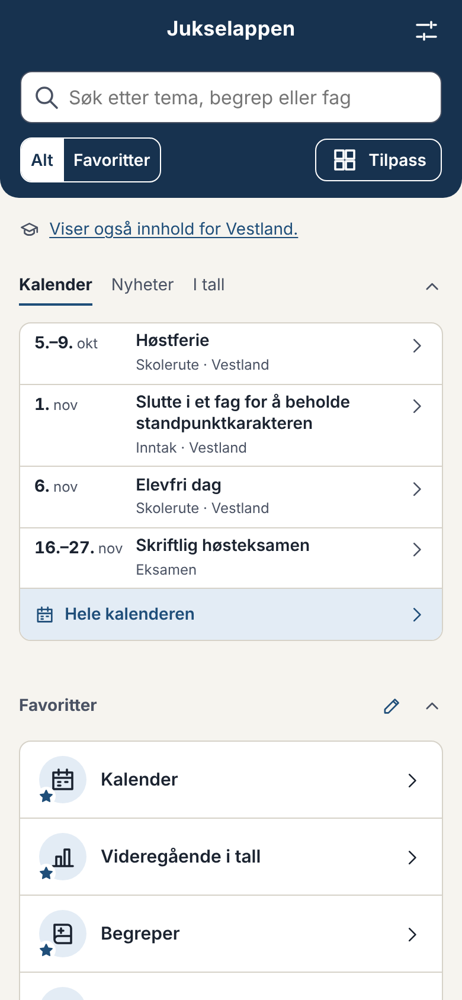 | 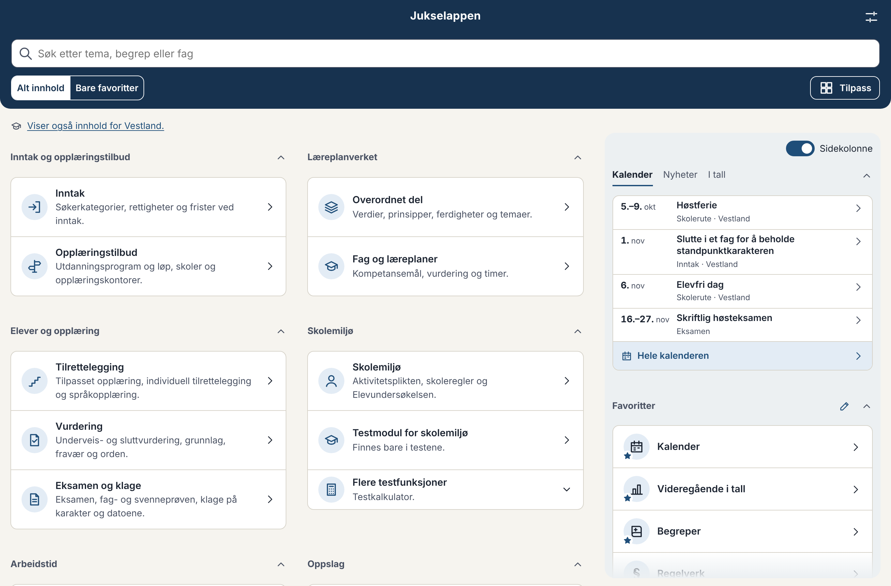 |
| Nyheter | 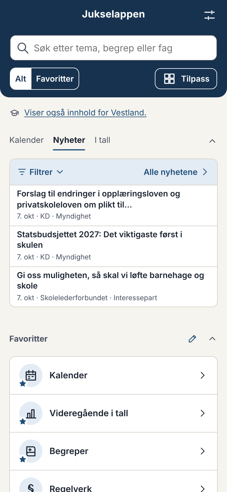 | 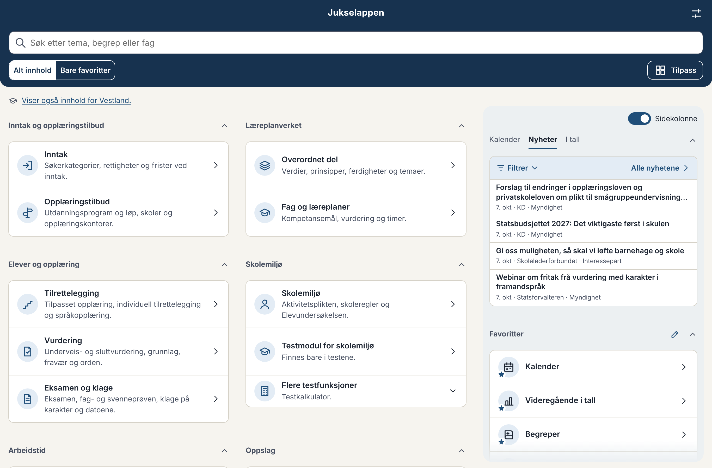 |
| I tall | 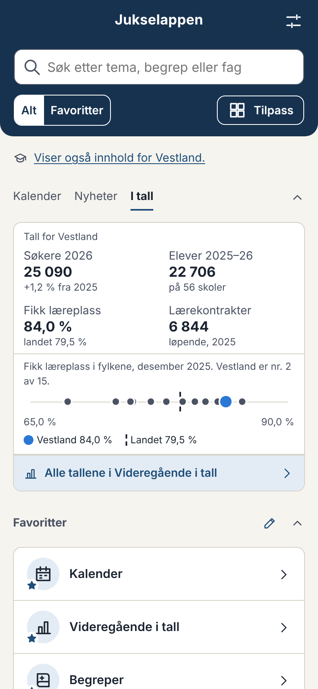 | 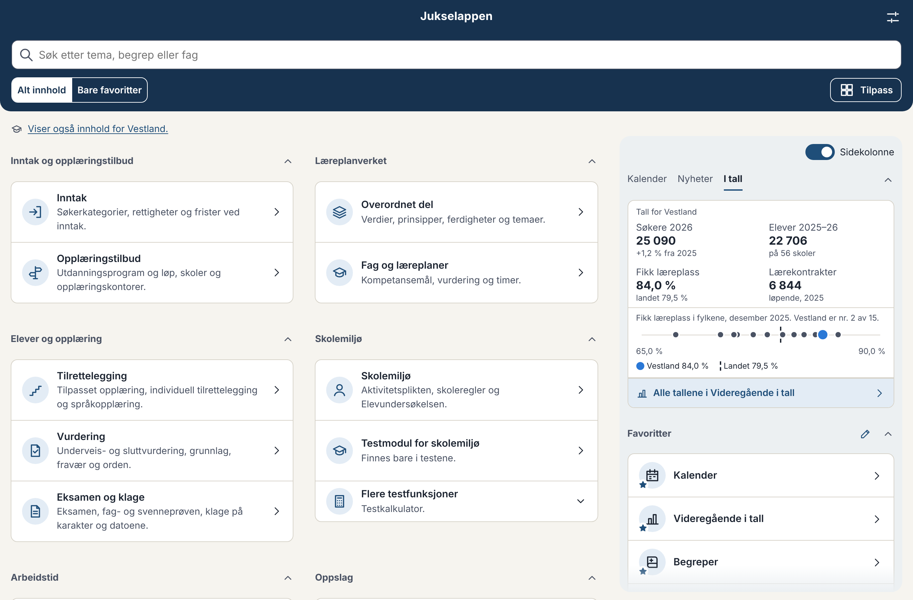 |

---

## Runde 5: dine svar 07.10.2026, kveld

- **K4:** De åtte ACOS-fylkene er med, vist for valgt fylke. Innlandet uten filter (egen feed for utdanning), de andre med ordfilter. Vestland, Trøndelag, Vestfold og Telemark er prøvd (se under).
- **K8:** HKdir er med, uten ekstra ord som utelukker.
- **Grensetilfellene:** Alle fem er med. Regelen er endret: Et generelt ord i tittelen tar med saken, med mindre tittelen selv nevner en annen del av utdanningen. Det slipper også gjennom «Regjeringen vil innføre nye krav til hva fremtidige lærere skal kunne» (KD), som handler om lærerutdanningen.
- **Fylke på nyhetssiden:** Et nytt valg «Fylke» ved siden av «Hvem» og «Kilde»: fylket ditt (standard), et annet fylke, alle fylkene eller ingen (bare de nasjonale kildene). Valget står i adressen (`?fylke=alle`). Når et annet fylke enn ditt vises, står kilden med fullt navn («Statsforvalteren i Vestland»). Forsiden følger alltid fylket i innstillingene.
- **Fjerde sak på forsiden:** Inntil fire saker. En sak som ikke får helt plass, vises ikke, og boksen blir lavere i stedet for å ha luft nederst. Resultat:
  - Skrivebord (sidekolonnen): fire saker når titlene er korte. Panelet er da 373 px, mot 366 px for kalenderen.
  - Mobil: tre saker, fordi titlene går over to linjer. Panelet er 323 px, lavere enn kalenderen (350 px).
  - Like mange eller flere favoritter er synlige som med kalenderen, i alle målingene.
  - Saken alene får samme høyde som listen, og ingressen slutter på en hel linje med «…».

### K4b. Vestland, Trøndelag, Vestfold og Telemark (prøvd i Actions 07.10.2026)

Ingen av de fire har en feed. Alle sider er hentet med én forespørsel, og robots.txt tillater stiene (unntatt det Trøndelag bruker, se under).

| Fylke | Hvordan | Størrelse | Saker | Med etter filteret | Vurdering |
|---|---|---|---|---|---|
| **Vestland** | Arkivet for temaet «Utdanning» (`/service/article/20/Utdanning`, JSON) | 33 kB | 20 siste, om lag 1 i uka | 14 av 20, alle relevante: inntaket, mobilregler i vidaregåande, fagbrev, KI for elevar og lærarar, nytt bygg for Os vgs. Ute: Arendalsuka, fylkesordføraren sine taler, valet, folkehelse. | **Ta med** med ordfilter. Det er ikke et dokumentert API, men det er det nyhetsarkivet selv bruker. |
| **Trøndelag** | Nyhetsarkivet er tomt i HTML-en. Sakene hentes av JavaScript fra `/api/`, og robots.txt stenger `/api/`. | 51 kB | 0 | – | **Ikke nå.** Vi kan ikke lese listen uten å bruke stien robots.txt stenger. Alternativ: spør Trøndelag fylkeskommune om en feed. |
| **Vestfold** | Hele «Aktuelt» på én side, med dato og ingress | 632 kB | 498 (alt siden 2020), om lag 3 i uka | 107. De nyeste er treffsikre: «Færre elever slutter på videregående skoler», «Felles krafttak for læreplass hjalp 84 søkere videre», «Inntakstall for skoleåret 2026/2027», «Nå bygges Elevtjenesten i Vestfold», nye rektorer. Feiltreff: «Skolestart med fokus på trafikksikkerhet» (barneskolen) og «Vestfold lærer av krigserfaringer fra Ukraina» («lærer» som verb). | **Ta med** med ordfilter. Siden er stor, men den hentes én gang om dagen. |
| **Telemark** | Som Vestfold (samme nettsidesystem) | 357 kB | 264, om lag 1 i uka | 41: «Yrkesfag topper søkerlista i Telemark», «Behov for flere lærebedrifter», «Mobbetallene i Telemark stuper», «Forbyr salg av energidrikk på skolene». Feiltreff: «Hovudlaus bokleik for skulestartarane». | **Ta med** med ordfilter. |

Alle tre jeg anbefaler, er lister og ikke feeder, som hos Udir og Utdanningsforbundet. **K4b:** Ja eller nei til Vestland, Vestfold og Telemark? Østfold svarer ikke, verken herfra eller fra Actions, og Oslo har ingen nyhetsliste for videregående.

## Runde 4: dine svar 07.10.2026, ettermiddag

- **K3 NRK:** Ikke med (enig i rådet).
- **K5 forskning.no:** Med, som type «Forskning», med eget filter: saker om barn og foreldre er bare med når de har et sterkt ord.
- **K6 NIFU:** Med, som type «Forskning», med vanlig filter.
- **K8 HKdir:** Prøvehentingen viser HTML-en rundt datoene på «Aktuelt», så jeg kan se om listen kan leses (se under).
- **Filteret på forsiden:** Linjen med filteret og «Alle nyhetene» har lys flate og blå tekst i liten skrift, som «Hele kalenderen». Den vanlige nedtrekkslisten ligger usynlig over teksten «Filtrer», så den virker som før med tastatur, skjermleser og mobilens egen liste. Når et filter er valgt, står navnet der i stedet (f.eks. «Udir»).

### K4. Fylkeskommunene, forklart og med tall

**Hva det gjelder:**
- **ACOS** er firmaet som lager nettsidesystemet til åtte fylkeskommuner: Akershus, Buskerud, Innlandet, Agder, Rogaland, Møre og Romsdal, Nordland, og Troms og Finnmark. Sidene er bygd likt, og hvert fylke har en nyhetsfeed per kategori. Lenken til feeden står på fylkets egen nyhetsside.
- **robots.txt** er en fil der et nettsted sier hvilke adresser automatiske hentere ikke skal bruke. Hos ACOS-fylkene står det «ikke hent `/artikkelRSS.aspx`». Feeden vi ville brukt, ligger på `/ArtikkelRSS.ashx`. Det er en annen adresse, så etter ordlyden er den tillatt.
- **Hvorfor jeg tok det opp:** Navnene ligner så mye at forbudet kan ha vært ment for feeden også. Vi følger robots.txt nøye ellers, og du skulle få vite det før du bestemmer deg.

**Mitt råd:** Det er forsvarlig å bruke feedene:
- Fylkene lenker selv til dem.
- Adressen som er stengt, er en annen side.
- Vi henter én gang om dagen med eget navn i henvendelsen (User-Agent), og bare tittel, dato, lenke og ingress.

Sier et fylke fra, tar vi det ut med en gang.

**Prøvehentingen i Actions 07.10.2026** (feeden for nyheter fra hvert fylke, med vanlig ordfilter):

| Fylke | Hvordan | Saker i feeden | Med etter filteret |
|---|---|---|---|
| Innlandet | ACOS, egen feed for utdanning | 5, om lag 1 i uka | 5 av 5, alle relevante: «Elevundersøkelsen 2026», «En av landets eldste laftebedrifter blir lærebedrift», «Tilsyn med individuelt tilrettelagt opplæring» |
| Buskerud | ACOS | 9 | 3: «Inviterer 1300 lærlinger … til årets lærlingundersøkelse», «8 500 elever har fått videregående skoleplass» og «Internasjonal musikkpris til Den kulturelle skolesekken» (grunnskole) |
| Rogaland | ACOS | 5 | 1: «Nytt skolebygg gir yrkesfagene et løft på Øksnevad» |
| Møre og Romsdal | ACOS | 20 | 2: «Suksess for Nettskolen: Elevtalet dobla på eitt år» og en kronikk om elevane |
| Troms | ACOS | 5 | 1: «Fordelte 15,2 millioner til kultur i skolen» |
| Nordland | ACOS | 5 | 1: «40 millioner til ny idrettshall i Alstahaug» (videregående i ingressen) |
| Akershus, Agder, Finnmark | ACOS | 5–9 | 0 de siste ukene |
| Vestland | eget arkiv med temaet «Utdanning» (JSON) | | Ikke prøvd ennå. Om lag én sak i uka, alle om utdanning. Ikke et dokumentert API. |
| Trøndelag | nyhetsarkiv filtrert på «Utdanning» | | Ikke prøvd ennå. Om lag én sak i uka. |
| Vestfold, Telemark | én stor nyhetsside med dato, ingen feed | | Ikke prøvd ennå. Trenger ordfilter. |
| Østfold | | | Svarer ikke, verken herfra eller fra Actions. |
| Oslo | Utdanningsetaten har ingen nyhetsliste | | Ikke med. |

**Forslag:**
- Ta med de åtte ACOS-fylkene. Innlandet uten filter (bare utdanning), de andre med ordfilter.
- Vestland og Trøndelag tas med når jeg har prøvd dem i Actions.
- Vestfold og Telemark venter, fordi sidene er store (300–650 kB) og har nyheter om alt.
- Sakene vises bare når fylket er valgt, som hos Statsforvalteren, og merkes «Myndighet» med fylkets navn som kilde.

Du tar stilling til to ting:
- (a) Ja eller nei til ACOS-feedene.
- (b) Ja eller nei til Vestlands interne arkiv og Trøndelags nyhetsarkiv. Ingen av dem er feeder, men begge er lister på én side, som hos Udir.

## Runde 3: dine svar 07.10.2026, og hva som er gjort

| | Svar | Gjort |
|---|---|---|
| D1 | Filter på hvem og kilde i én liste er fint. | Uendret. |
| D2 | Ingress fra alle kildene. | Som før. |
| D3 | Merke ved alle. Er alle statsforvalterne med, og sortert på fylke? | Merket står ved alle. Alle ti embetene hentes uten feil, og sakene vises bare når et av fylkene til embetet er valgt (f.eks. Troms og Finnmark for 55 og 56, Vestfold og Telemark for 39 og 40, og Østfold, Buskerud, Oslo og Akershus for 31, 33, 03 og 32). Med dagens filter gir de 0–4 saker hver. |
| D4 | Siste 30 dager, med «Vis eldre». | Gjort. Antallet står på knappen. |
| Design | Like høy som kalenderen, mer luft rundt filteret. | Panelet er nå 350 px på mobil og 366 px på skrivebord, nøyaktig som kalenderen, og filteret har 12 px luft rundt seg. Like mange favoritter er synlige som med kalenderen. |
| Design | Kalender og Nyheter ut av «Oppslag». | Gjort. Kalender, Nyheter og Videregående i tall nås fra panelet, søket og favorittene. |
| K1 | Ja til Utdanningsforbundets liste. | Med. |
| K2 | Ja til Lovdata. | Med: de vedtatte endringene i lovene og forskriftene appen har (de samme som i Kalender), med tittel og ingress på bokmål og nynorsk og datoen endringen ble vedtatt. De tre endringene som finnes nå, ble vedtatt i juni og er eldre enn 90 dager, så de står ikke i listen i dag. |
| K7 | Nei til UiO. | Ikke med. |
| K9 | Nei til e-post til KS. | Som nå: fast lenke til KS. |
| F1 | Claude vurderer ordfilteret. | Se F under. |
| P1 | Ja til daglig henting. | Arbeidsflyten **Nyheter** henter hver dag kl. 05.47, legger nyhetsfilen på `main` uten PR og publiserer. Testversjonen får de samme nyhetene. Kildesjekken melder en nyhetskilde som har feilet i mer enn to dager. |

### F. Ordfilteret, runde 2

Gjennomgått mot 486 saker fra KD, Udir og de ti statsforvalterne fra de siste 90 dagene. Endringer:
- **Tatt ut** fordi de ga feiltreff: «fylkeskommune» («Matfylket Innlandet», budsjettet for kommunene), «opplæring» («digital opplæring i fengsel», helse og omsorg), «undervisning» og «vurdering» («konkrete vurderinger», «ei heilskapleg vurdering av økonomien»). «Vurderingen» står fortsatt, som i «Råd om digitale hjelpemidler i vurderingen».
- **Ingressen:** Står de generelle ordene bare i ingressen, må minst to ulike treffe. Ett tilfeldig «elev» er ikke nok.
- **Nye ord som utelukker:** barnetrinn, mellomtrinn, ungdomstrinn, «de yngste», tiendeklassinger, nasjonale prøver og fellesskolen. Nytt generelt ord: privatskole.
- **Sakene fra før** vurderes på nytt ved hver henting, så et endret filter gjelder hele listen.

Resultat: 21 av 486 saker er med (før: 36). Jeg har gått gjennom alle: 19 handler om videregående eller om skolen generelt, og de to andre er grensetilfelle 1. **Grensetilfeller jeg vil høre din mening om:**
1. **«Inn på tunet for enkeltelever»** (Statsforvalteren i Agder og Innlandet): tiltak for elever med individuelt tilrettelagt opplæring, mest grunnskole. Med nå.
2. **«Statsbudsjettet 2027: 20,9 millioner til digital opplæring i fengsel»** (KD): Opplæring i fengsel er ofte videregående opplæring som fylkeskommunen har ansvar for, men saken nevner det ikke. Ute nå.
3. **«PISA 2025: Fortsatt kraftig nedgang …»** (KD): gjelder tiendeklassinger. Ute nå.
4. **«Slik skal elevene lære mer i skolen»** (KD): mest 1.–2. trinn, men også endringer i læreplaner. Ute nå.
5. **«Eksamen i sikker nettleser»** (Statsforvalteren): gjelder grunnskolen fra 2027. Ute nå.

### K. Prøvehentingen i Actions 07.10.2026 (K3, K5, K6 og K8)

Kildene under er stengt fra skymiljøet og ble prøvd i arbeidsflyten **Nyheter** (PR #121). Rapporten står i sammendraget for kjøringen. Ingen av dem vises i appen før du sier ja.

**K3. NRK.** Hvorfor treffer filteret så dårlig: NRK har feeder per distrikt (toppsaker og siste), men ingen kategori for skole, og titlene er skrevet for å fange interesse, ikke for å si hva saken gjelder. «Elev», «skole» og «lærer» står oftere i saker om ulykker, vold og kommunebudsjett enn i saker om opplæringen. Tallene fra én uke:
- NRK Vestland, toppsaker: om lag 47 saker i uka. Med strengt filter (sterke ord i tittelen): 0. Med vanlig filter: 1 («På denne skulen er det syklar til over éin million kroner», en grunnskole).
- NRK Vestland, siste: om lag 140 saker i uka. Strengt: 0. Vanlig: 0. Utelukket: «Opna tilsyn ved Brakanes skule» (grunnskole).
- NRK Innlandet, toppsaker: om lag 23 i uka. Strengt: 0. Vanlig: 1 («Vil ha forbod mot smartbriller: Her blir dei brukt i skulekvardagen», relevant).

Mitt råd: **ikke ta med NRK nå.** Med strengt filter blir det nesten ingen saker. Med vanlig filter blir det én–to i uka per distrikt, og omtrent halvparten gjelder grunnskolen. Store saker om videregående kommer ofte også fra Utdanningsnytt, Statsforvalteren eller Udir. Vil du likevel prøve, foreslår jeg vanlig filter, bare toppsakene i fylket som er valgt, i testversjonen i to uker.

**K5. forskning.no** (taggen «skole og utdanning», feed som forskning.no selv tilbyr til andre nettsteder): om lag 3 saker i uka. 42 av de siste 92 saker passerer filteret, men mange gjelder barn og grunnskole. Eksempler som passer for videregående:
- «Konkurransen mellom osloskolene kan gi snillere karakterer» (6. okt)
- «Å ta fagbrev som voksen kan være utfordrende» (27. sep)
- «Slik kan elevene på yrkesfag få mer ut av matte-undervisningen» (29. jun)
- «Hvem er eksamensvurderingen egentlig til for?» (10. aug)
- «Skolefravær: – At så mange i denne gruppa gruer seg til å gå på skolen, er alvorlig» (8. aug)

Eksempler som gjelder grunnskolen og ville sluppet gjennom: «Slik bør foreldre og lærere gå fram for å sikre at barna blir gode lesere» og «Trygg og ryddig skolegård. Men hva vil barna selv ha?». Mitt råd: **ta med**, som type «Forskning», med et strengere filter for denne kilden: sterkt ord i tittelen eller ingressen, eller et generelt ord i tittelen uten «barn», «barna» eller «foreldre». Da blir det om lag én sak i uka.

**K6. NIFU** (`nifu.no/category/nyhet/feed/`): Feeden viser bare de tre siste sakene, og de tre kom de tre siste dagene, så det er om lag én sak om dagen. De handlet om forskning og arbeidsliv. Ingen av de tre siste gjaldt skolen («NIFU analyserer statsbudsjettets betydning for forskning», «De eldste ansatte har svakere ferdigheter i adaptiv problemløsning …», «Ekstern finansiering av FoU relatert til sjømatnæringen»). Med daglig henting får vi med alt, og filteret slipper gjennom saker om rapporter om videregående, som «Videregående opplæring i utvikling og endring» (NIFU-rapport 2025:23). Mitt råd: **ta med** med vanlig filter. Det blir trolig én–to saker i måneden.

**K8. HKdir (prøvd 07.10.2026):** «Aktuelt» (`hkdir.no/aktuelt`) kan leses med én forespørsel. Siden har alle sakene fra 2023 til nå, 171 i alt, hver med tittel, «Publisert: dato» og ingress. Det er ingen feed og ingen robots.txt. De publiserer lite, om lag én sak hver tiende dag, og mye gjelder høyere utdanning, fagskoler og godkjenning av utenlandsk utdanning. 29 av de 171 sakene passerer ordfilteret. Det blir 1–2 saker i måneden. Eksempler:
- «Fire skoler hedres for fremragende resultater» (28. sep 2026)
- «Internett, foreldre og KI: Slik søker unge råd om utdanning» (30. mar 2026)
- «Dette er de ti mest populære yrkene blant unge» (4. jun 2025)
- «Mange unge jenter er verken i jobb eller skole» (8. mar 2024)
- «Gi dine innspill til kompetansestandarder for karriereveiledning i skolen» (27. sep 2023)
- «Underveis mot fagbrev med Kompetansepluss fagopplæring» (29. mar 2023)
- «Modulstrukturert opplæring gjev fleksibilitet» (9. feb 2023)
- «To nye land i godkjenningsordningen for utenlandsk fag- og yrkesopplæring» (6. jun 2024)

Med i filteret nå, men ikke relevant: «Fagskulane veks i takt med arbeidslivet sitt behov» og «Rekordmange har fått tilbud om studieplass». De kan tas bort ved å legge «fagskul» og «studieplass» til ordene som utelukker.

Mitt råd: **ta med**, som type «Myndighet», med vanlig filter og de to ordene i tillegg. Det blir få saker, men de handler om karriereveiledning, fag- og yrkesopplæring og voksnes opplæring, som ingen av de andre kildene dekker. Det er en liste og ikke en feed, som hos Udir og Utdanningsforbundet.

**Skolenes landsforbund:** Feeden svarte ikke, verken herfra eller fra Actions (heller ikke uten www). Den kan ikke tas med nå.

## D. Designet (runde 2, etter dine svar 07.10.2026)

**Forsiden** (visningen «Nyheter» i panelet, avgjørelse 081):
- Fast høyde, som ikke er større enn kalenderens: 340 px på mobil og 356 px på skrivebord, mot 350–373 px for kalenderen. Målt med åtte favoritter er like mange eller flere favoritter synlige under som med kalenderen, på mobil, skrivebord og en laptop med lav skjerm. Sidekolonnen trengte ikke bli høyere.
- Tre saker, høyst to fra hver kilde, med tittel på høyst to linjer i litt mindre skrift. Under: dato, kilde og hvem («7. okt · KD · Myndighet»). Ingen ingress i listen.
- **Filteret** øverst: én nedtrekksliste med teksten «Filtrer på hvem eller kilde …», med to grupper: hvem (myndigheter, fagpresse, organisasjoner) og kilde. Når et filter er valgt, heter første valg «Vis alle». Filteret huskes på enheten. Ved siden av står «Alle ›» til nyhetssiden.
- **Et trykk på en sak** viser saken alene i den samme plassen: tittelen, ingressen (høyst fire linjer), dato og kilde, og knappen «Les saken hos KD». «‹ Tilbake til nyhetene» øverst tar deg tilbake til listen.

**Nyhetssiden:**
- Sakene per dag, uten ingress. **Første trykk** på en sak viser ingressen og «Les saken hos …». Saken får en lys bakgrunn. **Neste trykk** åpner saken hos kilden. Pilen oppe til høyre lukker saken igjen. Saker uten ingress er en lenke med en gang. Hva som er åpent, huskes når du går tilbake til siden.
- «Kilder»-boksen er tatt bort. Kildelisten til høyre (på mobil under) er kildene til siden.
- Bryteren for skissen med og uten ingress er tatt bort.

| | Mobil | Skrivebord |
|---|---|---|
| Forsiden | 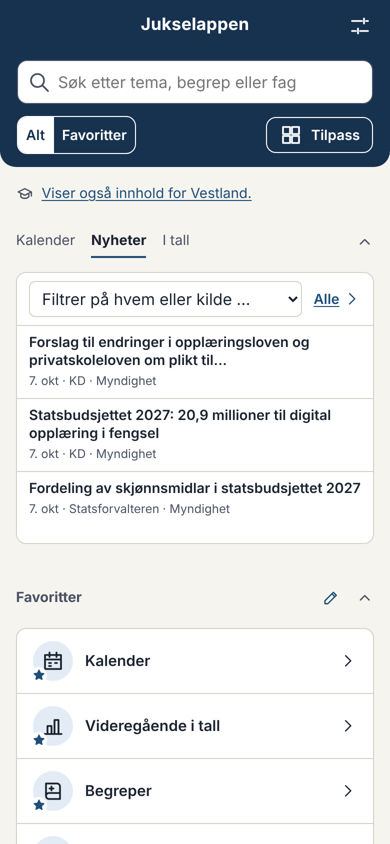 | 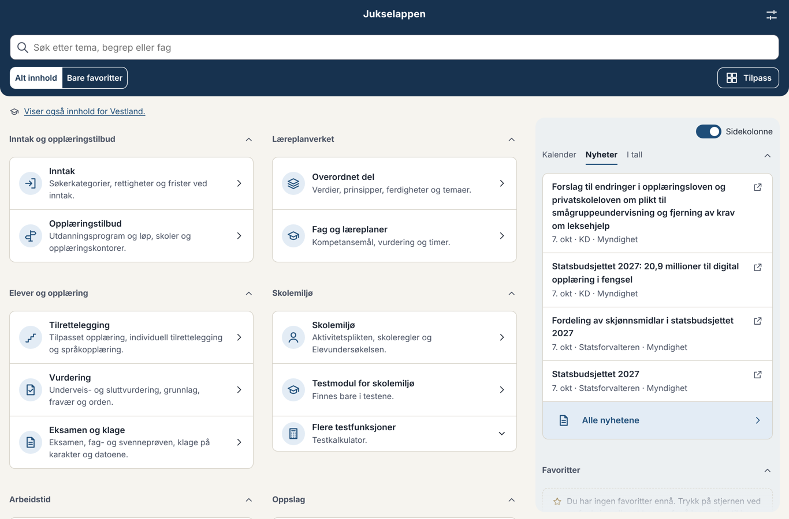 |
| Forsiden, en sak valgt | 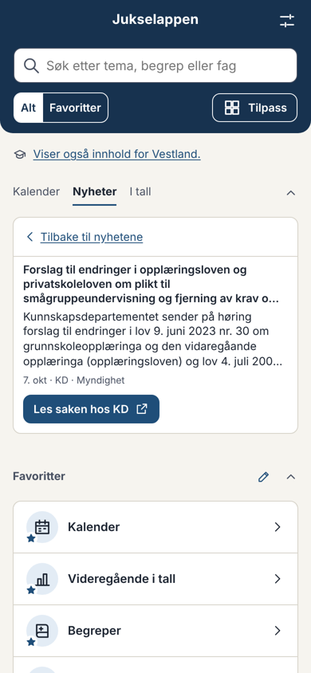 | 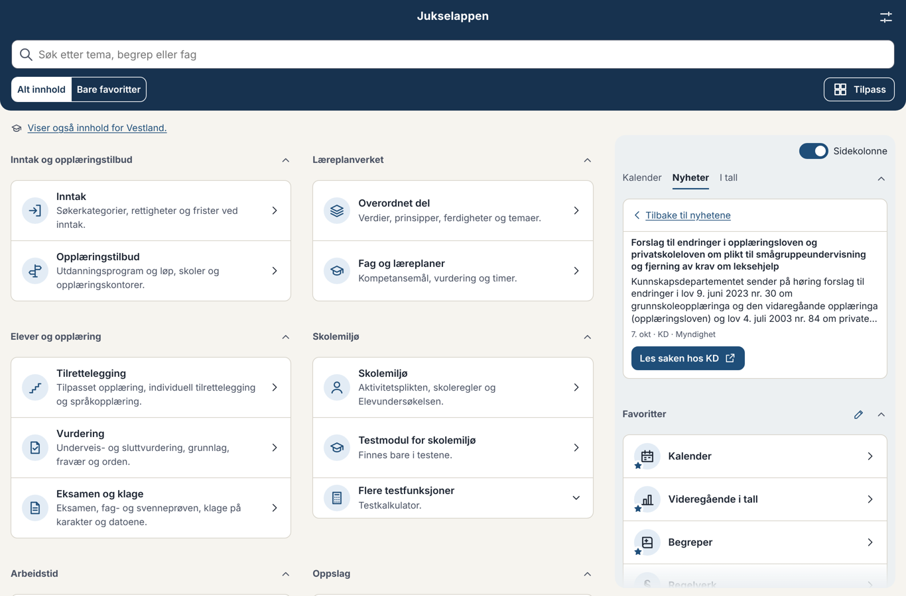 |
| Nyhetssiden, en sak åpnet | 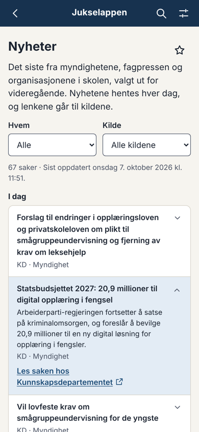 | 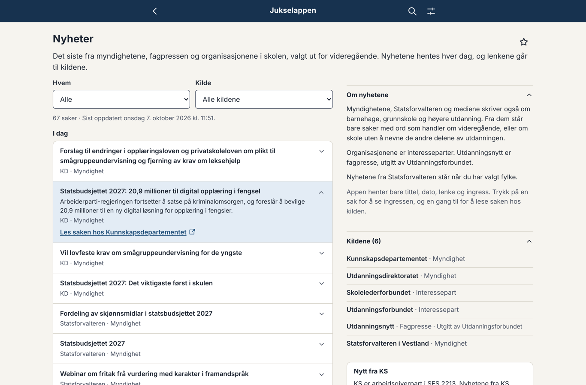 |

**Spørsmål:**
- **D1.** Filteret på forsiden har både hvem og kilde i én liste. Er det greit, eller vil du ha bare det ene?
- **D2. Ingress fra hvem:** alle, eller bare myndighetene (NLOD)? Organisasjonene, Utdanningsnytt og Statsforvalteren oppgir ingen lisens. Ingressen er deres eget sammendrag, og vi lenker alltid til saken. Mitt råd: alle, så listen ser lik ut, men du avgjør.
- **D3. Merket «Myndighet»** står ved alle saker fra KD, Udir og Statsforvalteren. Skal bare interesseparter og fagpresse ha merke, så listen blir roligere?
- **D4. Hvor langt tilbake:** 90 dager og høyst 25 saker per kilde. Siden blir lang (67 saker med Vestland valgt). Skal den vise de siste 30 dagene, med «Vis eldre» under?

---

## K. Kildene

Kriteriene fra arbeidsordren: feed, eller liste på én side med tittel, dato og lenke (én forespørsel per henting); robots.txt tillater stien; ingen innlogging; relevant for videregående. Ingen skraping av hver sak.

**I skissen nå (15 kilder):**

| Kilde | Type | Hvordan | Filter | Saker i dag (med / i feeden) | Vurdering |
|---|---|---|---|---|---|
| Kunnskapsdepartementet | Myndighet | RSS | ord | 10 / 100 | Ta med. NLOD. |
| Udir | Myndighet | liste, én side | ord | 5 / 10 | Ta med. NLOD. Bare ti saker per side, så den må hentes hver dag. |
| Statsforvalteren (10 embeter) | Myndighet | RSS per embete | ord + fylke | 0–6 / 50 | Ta med, vises bare når fylket er valgt. Feeden har bare datoen saken sist ble endret; skriptet beholder den første datoen det så. |
| Utdanningsnytt (taggen videregående) | Fagpresse, utgitt av Utdanningsforbundet | RSS | ingen | 36 / 133 | Ta med. robots tillater alt. Om lag tre saker i uka. |
| Skolelederforbundet | Interessepart | RSS | ingen, medlemstilbud tas bort | 9 / 10 | Ta med. |
| Utdanningsforbundet | Interessepart | liste, én side | ingen | 12 / 12 | **K1:** Du må si ja, fordi det er en liste og ikke en feed. robots tillater stien, men har `ai-train=no` og stenger KI-roboter. Vi henter med vår egen User-Agent og bruker ikke teksten til trening, men du bør vite det. |

**Fra arbeidsordren, ikke med ennå:**
- **Skolenes landsforbund** (WordPress `/feed/`): stengt fra skymiljøet. Prøves i første kjøring i Actions.
- **Lovdata (Lovtidend):** Endringene står allerede i Kalender. **K2:** Skal de også stå i nyhetene? Lovdata har RSS for Lovtidend, men den kunne ikke prøves herfra (Lovdata svarte 405).
- **KS og KF Infoserie:** ikke hentet, som rådet i arbeidsordren. Siden har en fast lenke «Nytt fra KS» til ks.no. **K9:** Skal jeg skrive et utkast til e-posten til KS og Kommuneforlaget (punkt 1 i rådet)?

**Nye kilder du ba meg vurdere:**

| Kilde | Hva finnes | Vurdering |
|---|---|---|
| **NRK** | Feeder per distrikt og seksjon (f.eks. `nrk.no/vestland/toppsaker.rss`). Ingen feed for skole. Vilkårene for RSS (lest via søk) tillater bruk med lenke til nrk.no, merket NRK og med uendret tittel. | **K3:** Mulig, som type «Nyhetsmedium», bare distriktet for fylket som er valgt, og bare saker med sterke ord i tittelen («videregående», «lærling», «elev» …). Med et slikt filter blir det 1–3 saker per distrikt i uka, og 20–40 % av dem er likevel ikke relevante (f.eks. ulykker der en elev er nevnt). Mitt råd: vent til de andre kildene har gått en stund, og prøv så NRK Vestland alene i testversjonen. |
| **Fylkeskommunene** | Fire plattformer. ACOS-fylkene (Akershus, Buskerud, Innlandet, Agder, Rogaland, Møre og Romsdal, Nordland, Troms og Finnmark) har RSS per nyhetskategori, men bare 5–9 saker. Innlandet har egen kategori for utdanning. Vestland har et internt JSON-endepunkt med temaet utdanning. Trøndelag har en nyhetsside filtrert på utdanning. Vestfold og Telemark har én stor nyhetsside. Oslo har ingen nyhetsliste for videregående. Østfold kunne ikke undersøkes. | **K4:** Mulig, vist bare når fylket er valgt, som Statsforvalteren. Men: (a) ACOS stenger `/artikkelRSS.aspx` i robots.txt, en annen sti enn feeden vi ville brukt (`ArtikkelRSS.ashx`). Det er formelt lov, men bør avklares med fylket. (b) Vestlands endepunkt er ikke et dokumentert API. Mitt råd: begynn med Innlandet (egen feed for utdanning) og Vestland (spør fylket om endepunktet), og ta resten når vi ser hvordan det virker. |
| **forskning.no** | Feed for hver emneside, f.eks. taggen «skole og utdanning». forskning.no sier selv at feedene kan brukes på andre nettsteder. Eies av universitetene og høgskolene. | **K5:** Ta med som type «Forskning», med ordfilter. Om lag én relevant sak i uka. Prøves først i Actions (stengt herfra). |
| **NIFU** | WordPress-feed for nyheter (`/category/nyhet/feed/`). Rapporter om gjennomføring, fag- og yrkesopplæring og lærere. | **K6:** Ta med med ordfilter, når feeden er prøvd i Actions. |
| **UiO, Institutt for lærerutdanning og skoleforskning** | Feed for nyheter (`?vrtx=feed`). | **K7:** Usikker relevans. Mye om lærerutdanningen. Mitt råd: ikke nå. |
| **Utdanningsforskning.no, KSU (Kunnskapssenter for utdanning)** | Ingen feed funnet. | Ikke ta med. |
| **De andre universitetene og høgskolene, Fafo, SINTEF, Forskningsrådet, de nasjonale sentrene (Lesesenteret, Skrivesenteret osv.), Idunn** | Feeder finnes hos noen, men med lite om videregående, eller ingen feed. | Ikke ta med nå. Ta gjerne med en enkelt du vet er nyttig (K8). |

---

## F. Filteret

Ordene står i `content/nyheter/kilder.yaml`, så du kan endre dem uten kodeendring:
- **Sterke ord** tar alltid med saken: videregående, vgs, vg1–vg3, yrkesfag, lærling, læreplass, fagbrev, inntak, fylkeskommune, opplæringslova og -forskrifta, privatskolelova, SFS 2213, lektor m.fl.
- **Generelle ord** (skole, elev, lærer, rektor, eksamen, fravær, læreplan, vurdering, skolemiljø, opplæring m.fl.) tar med saken når den ikke nevner barnehage, grunnskole, trinn, SFO, universitet, høgskole, fagskole, studenter eller lærerutdanning.
- Nevner tittelen en annen del av utdanningen og har ingen sterke ord, er saken ute («En ny skoledag for 1. og 2. trinn», «Rekordmange får tilbud om fagskoleutdanning»).

**Eksempler fra i dag:**
- **Med som bør være med:** «Høring om overgangsordning for modulstrukturerte læreplaner» (Udir), «No får alle elevar i vidaregåande utstyrsstipend» (KD) og «Klage på vedtak om individuell tilrettelegging i skulen» (Statsforvaltaren i Vestland).
- **Med som kanskje ikke bør være med:** «Statsbudsjettet 2027: 20,9 millioner til digital opplæring i fengsel» (KD) og «Fordeling av skjønnsmidlar i statsbudsjettet 2027» (Statsforvaltaren i Vestland).
- **Ute som kanskje burde vært med:** «Slik skal elevene lære mer i skolen» (KD; ingressen nevner grunnskolen) og «Nytt til barnehage- og skulestart» (Statsforvaltaren i Vestland).

**F1.** Er dette riktig nivå, eller skal filteret være strengere (bare sterke ord) eller løsere? Si gjerne fra om ord som mangler.

---

## P. Henting og publisering (avgjørelse 084, forslag)

- Én henting om dagen kl. 05.47. Filen `data/nyheter/nyheter.json` committes til `main` uten PR når den passer skjemaet, og appen publiseres på nytt.
- Nyhetsfilen hentes ved siden av appen, så en ny dag med nyheter gir ingen ny versjon av appen og ikke noe varsel om oppdatering.
- Feiler en kilde, eller gir den null saker, står sakene fra før, og kilden er merket på siden. Kildesjekken tar dem med i Kildestatus.

**P1.** Ja til avgjørelse 084 slik den står? Da lager jeg arbeidsflyten, og første kjøring i Actions prøver også kildene som er stengt herfra (Skolenes landsforbund, NRK, forskning.no og NIFU).

---

## Videre

Når du har svart: designet ferdig → ende-til-ende-tester → versjons-PR. Kilder du sier ja til i K3–K8, kommer med i samme runde hvis de virker fra Actions.
