# Forslag: fase 8 – Dagens jukselapp

*Status 08.10.2026:* Eier godkjente designet etter runde 2, med alternativ C. Levert i 0.43.0 (avgjørelse 085). Rundene under står som de ble skrevet, nyeste øverst.

Til eier. Svar gjerne punkt for punkt (f.eks. «J1 ja, men uten paragrafer, J4 A»). Rundene står med den nyeste øverst.

---

## Svar på runde 2 (eier 08.10.2026) og leveransen

- **J7:** B med C. Første besøk hver dag står panelet på jukselappen.
- **J8:** Teksten er grei, med en setning om at jukselappen vises først ved første besøk hver dag.
- Testing, fletting og publisering, med versjon valgt av Claude: 0.43.0.
- Skissen er erstattet av `fakta()` i manifestene. Om lag 1 600 fakta fra tolv moduler, se avgjørelse 085.

---

## Runde 2: dine svar 08.10.2026

- **Plass:** B, en fjerde visning i panelet. Variant A og adressen `?jukselapp=panel` er tatt bort.
- **Ingen rad på forsiden** som slår den på. Bryteren står under Innstillinger og under «Tilpass», den samme begge steder. Slått på blir «Jukselapp» valgt i panelet, så den vises med en gang.
- **Velkomsten:** I fase 10 har velkomsten fått et trinn som spør om brukeren vil slå på dagens jukselapp (`OPPDRAG.md`).
- **Oppsettet** er som kalenderen, nyhetene og tallene, uten gul kant:
  - en boks med tittelen i halvfet og faktumet i liten skrift, og typen i dempet skrift under
  - «I regelverket» og «Kilder» som lukkede rader
  - den blå linjen nederst, med «Ny jukselapp» til venstre og lenken til stedet i appen til høyre
- **Fakta:** Typene er godkjent, og fakta som ikke er kontrollert, kan vises. I skissen er det lagt til hovedtariffavtalen (ferie og overtid) og mer fra overordnet del (de fem grunnleggende ferdighetene, de tre tverrfaglige temaene samt profesjonsfellesskap og skoleutvikling). Skissen har nå 15 fakta.
- **Bytte:** hver dag, og med knappen.
- **Med «Bare favoritter»:** Jukselappen kan ikke være favoritt, så den står som egen gruppe når den er slått på.

Panelet med jukselappen er om lag 235 px høyt på mobil (390 px), mot 337 px for kalenderen. Boksen blir høyere når kildene åpnes.

| | Mobil | Skrivebord |
|---|---|---|
| Jukselapp i panelet | 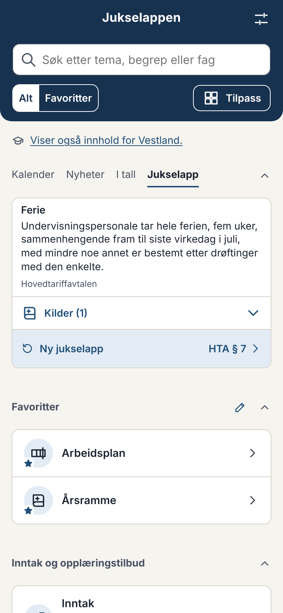 | 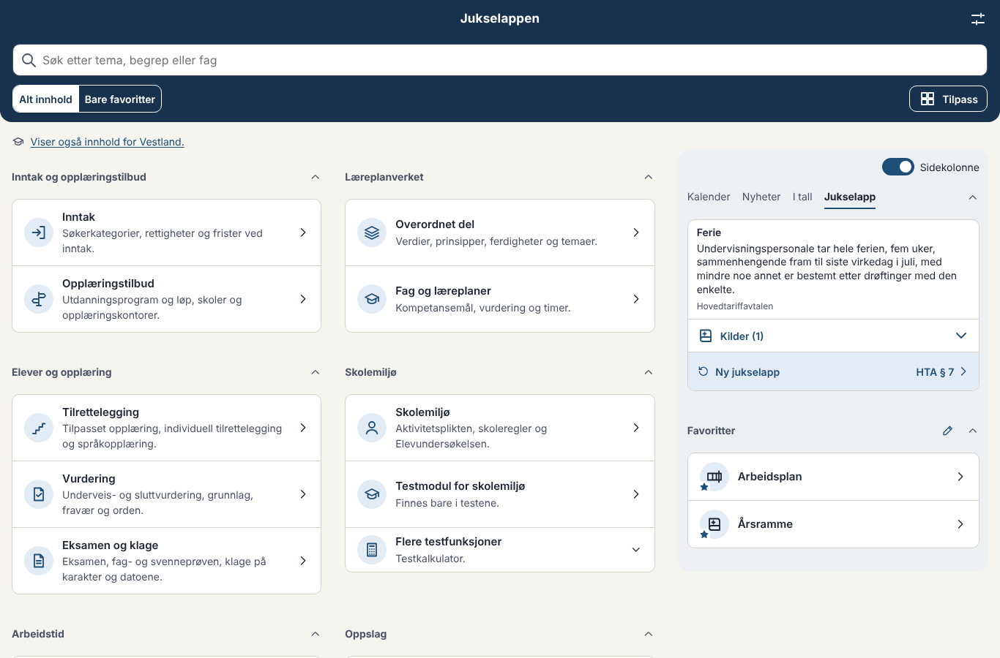 |
| 320 px, nynorsk | 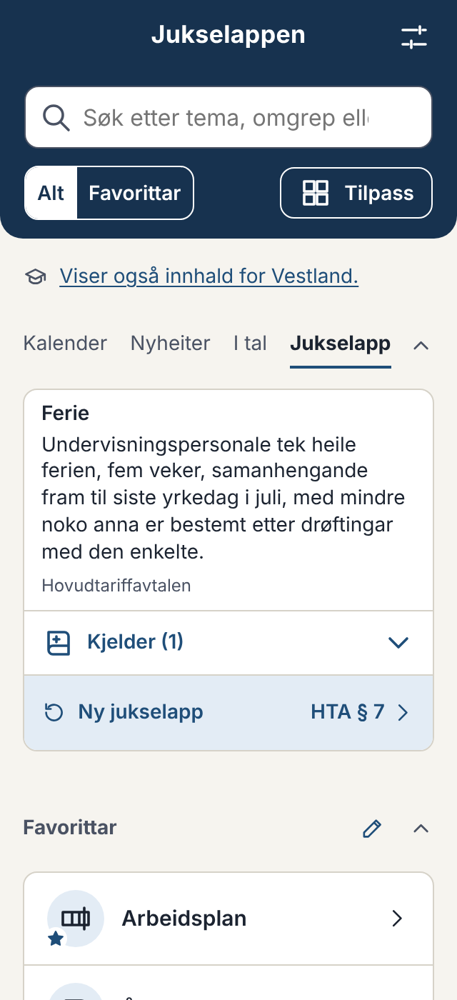 | |
| «Tilpass» og Innstillinger | 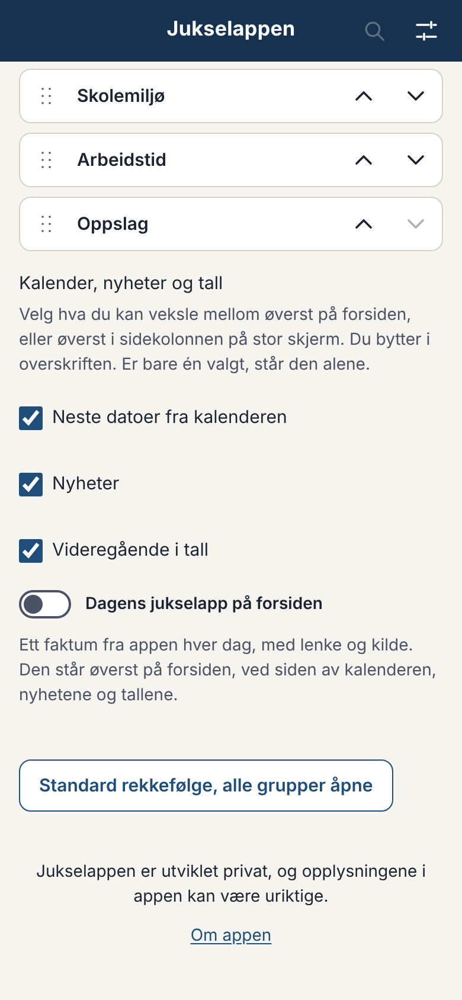 | 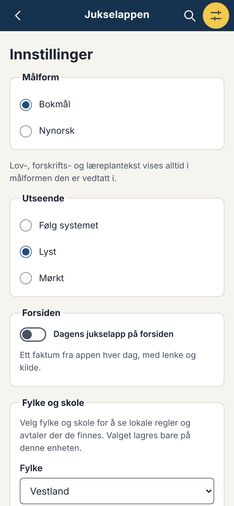 |

### J7. Et tredje alternativ?

Ulempen med B er at panelet husker visningen. Den som bruker kalenderen, ser sjelden jukselappen. To måter å løse det på:

- **C: Jukselappen først én gang om dagen.** Første gang forsiden åpnes en ny dag, står panelet på «Jukselapp». Bytter brukeren visning, gjelder valget resten av dagen. Det er ikke noe nytt element på forsiden, og ett trykk tar deg til kalenderen. Appen husker datoen jukselappen sist ble vist, lokalt.
- **D: En linje nederst i panelet.** Under kalenderen, nyhetene og tallene står én linje: «Dagens jukselapp: Ferie …», som bytter til jukselappen. Den er alltid synlig, men er et nytt element på forsiden, som du ikke ønsket.

**Mitt råd:** B som nå, eventuelt med C. Si fra om du vil ha C, så legger jeg det inn i skissen.

### J8. Teksten under bryteren

«Ett faktum fra appen hver dag, med lenke og kilde. Den står øverst på forsiden, ved siden av kalenderen, nyhetene og tallene.» Under «Tilpass» står bryteren under valgene for kalenderen, nyhetene og tallene. Greit?

---

## Runde 1: typer fakta, kontroll, bytte og plass

Skissen har elleve ekte fakta fra innholdet, ett eller to av hver type. Faktaene står i en egen fil til designet er godkjent. Etterpå lager hver modul faktaene sine selv med `fakta()` i manifestet. Skissen virker bare i testversjonen, og den publiserte appen er uendret.

### Slik ser det ut

| | Mobil | Skrivebord |
|---|---|---|
| A: egen rubrikk (anbefalt) | 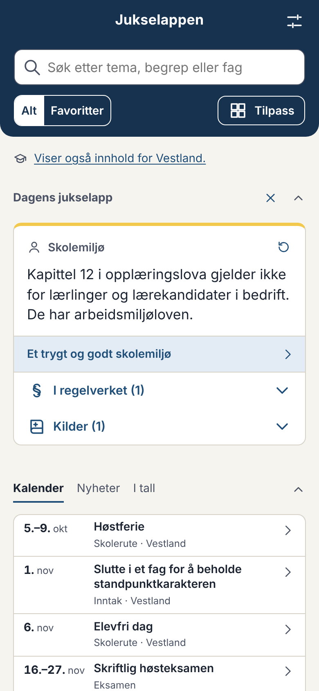 | 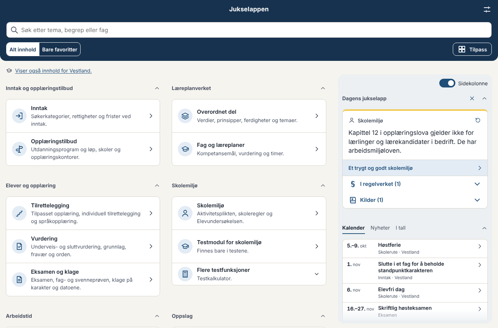 |
| B: fjerde visning i panelet | 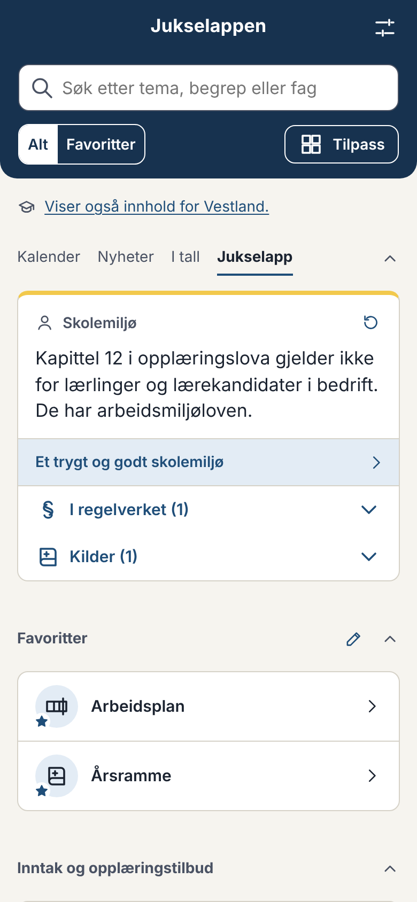 | 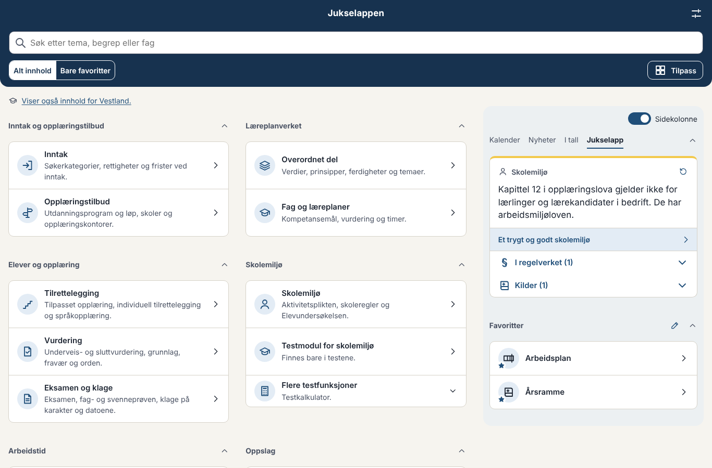 |
| Av, med teksten som slår den på | 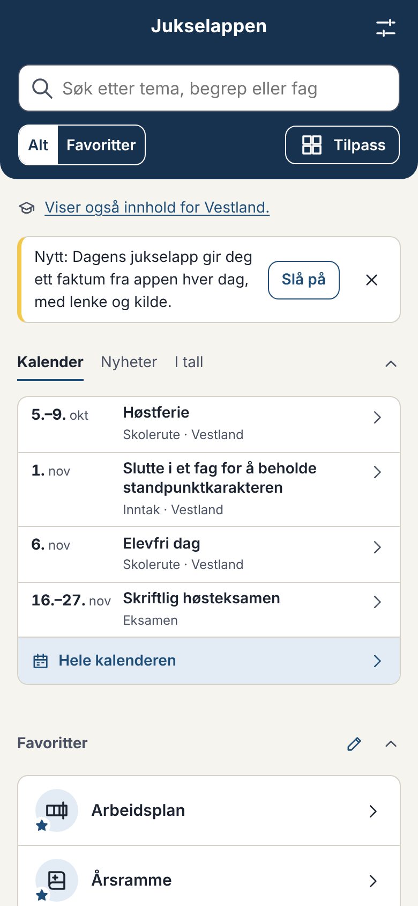 | 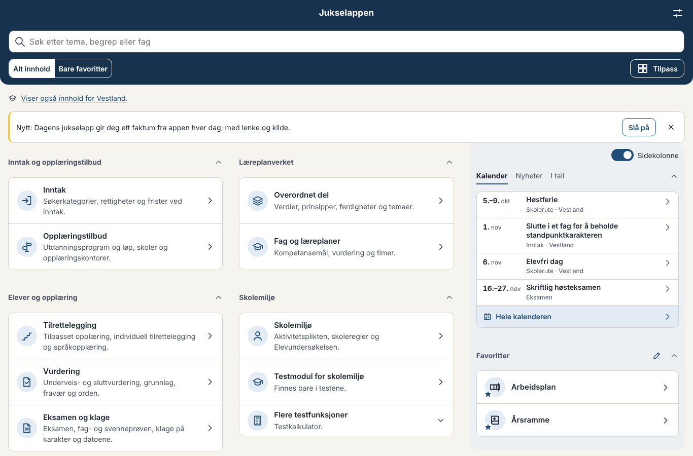 |
| Innstillinger |  | |

**Kortet** (likt i A og B):
- Øverst typen med ikon («Begrep», «Frist», «I tall · Vestland») og knappen for ny jukselapp (↻).
- Faktumet i litt større skrift, én til tre setninger.
- En blå lenkelinje til stedet i appen, som «Hele kalenderen» i panelet.
- «I regelverket» og «Kilder» som lukkede rader nederst (`Kortfot`, avgjørelse 071).
- En gul kant øverst, som lappen i logoen.

Lukket viser overskriften begynnelsen av faktumet, som de andre gruppene.

### J1. Hvilke typer fakta

Hver modul gir fakta fra innholdet og dataene den alt har. Teksten er de første setningene i elementet (høyst om lag 220 tegn), uten lenkene i teksten. Et element som ikke gir mening alene, kan tas ut med et felt i innholdet.

| Type | Fra | Eksempel |
|---|---|---|
| **Begrep** | Begrepsbanken (165) | «Et årsverk for lærere er 1687,5 timer, eller 1650 timer for lærere som er 60 år og eldre.» → Årsverk |
| **Regel** | Vurdering, eksamen, inntak, skolemiljø, tilrettelegging (om lag 200 forklaringer og regler) | «Fraværsgrensen er nådd når udokumentert og helserelatert fravær til sammen er 10 prosent av årstimetallet i faget.» → Fraværsgrensen |
| **Frist** | Fristene i inntak og eksamen, med regelen og ikke datoen | «Fristen for å klage på standpunktkarakterer, vedtak om IV og eksamenskarakterer er ti kalenderdager.» → Klage på karakter |
| **Fag** | Fagene med årsramme i SFS 2213 | «Matematikk 1P på Vg1 har 140 årstimer. Årsrammen for matematikk på studiespesialiserende Vg1 er 525 timer.» → Matematikk 1P |
| **Overordnet del** | Første setning i hver av de 24 delene | «Skolen skal legge til rette for og støtte elevenes utvikling av de fem grunnleggende ferdighetene …» → 2.3 Grunnleggende ferdigheter |
| **Paragraf** | Et utvalg paragrafer i opplæringslova og opplæringsforskrifta, uoversatt | «Alle elevar har rett til eit trygt og godt skolemiljø som fremjar helse, inkludering, trivsel og læring.» → § 12-2 |
| **Arbeidstid** | Verdiene i SFS 2213 med sitat | «Arbeidsåret er elevenes skoleår og 6 dager à 7,5 timer til kompetanseutvikling, planlegging og lignende.» → Arbeidsplan |
| **Opplæringsløp** | Veiene til fag- og svennebrev | «Den vanlige veien til fagbrev: Vg1 og Vg2 på et yrkesfaglig utdanningsprogram, og så læretid i bedrift med lærekontrakt.» → Lærling |
| **I tall** | Videregående i tall for valgt fylke, ellers landet | «81,6 prosent av elevene i Vestland som startet på Vg1 i 2019, fullførte og besto innen fem eller seks år. I hele landet var det 81,8 prosent.» → Vestland i tall |
| **Fylket** | Fylkets frister, inntaksregler og skoleregler, bare med valgt fylke | «Det er ingen søknadsfrist for voksne i Vestland, men søkeren bør søke innen 1. mars …» → Vestland fylkeskommune |

**Ikke med:** nyhetene (ferskvare, de har sin egen visning), datoene i kalenderen (står i «Neste datoer»), Elevundersøkelsen (stor fil) og skoleregisteret.

**Spørsmål:**
- Er typene riktige? Noe som bør ut eller inn?
- Paragrafene: et utvalg (forslag: kapitlene appen bruker mest, om tilpasset opplæring, inntak, vurdering og skolemiljø) eller alle?
- Skolen du har valgt: tall om skolen (elevtall, fravær) når skolen er valgt?

### J2. Bare kontrollert innhold?

Ingenting har `kontrollert` satt ennå, så med bare kontrollert innhold blir jukselappen tom.

**Mitt råd:** Vis alt nå, med brukserklæringen som forbehold (avgjørelse 016), som resten av appen. Faktumet er en lenke inn til innholdet, og innholdet har det samme forbeholdet der. Jeg lager det slik at det er én linje å endre for å vise bare kontrollert innhold, eller kontrollert innhold først, når kontrollrundene har kommet langt nok.

### J3. Hver dag, med en knapp eller begge?

**Mitt råd: begge.** Faktumet velges ut fra datoen, så det er det samme hele dagen og likt for alle med samme fylke. Ingenting lagres. Knappen ↻ viser et nytt med en gang. Neste dag kommer dagens igjen. Rekkefølgen hopper mellom modulene, og alle faktaene kommer før noe gjentas.

### J4. Egen rubrikk eller fjerde visning i panelet?

**A: egen rubrikk (anbefalt).** Står først på forsiden når den er slått på, og øverst i sidekolonnen på skrivebord. Den kan flyttes og lukkes under «Tilpass» som de andre gruppene. Krysset i overskriften slår den av.
- Den som har slått den på, ser den uten å bytte visning.
- Kortet er lavt: 270 px på mobil (390 px bred).

**B: fjerde visning i panelet.** «Jukselapp» ved siden av «I tall».
- Tar ingen ekstra plass.
- Fire valg får akkurat plass på 320 px, og «Nyheiter» på nynorsk gjør det trangere.
- Panelet husker visningen, så den som bruker kalenderen, ser sjelden jukselappen.

### J5. Teksten som slår den på

En rolig rad under linjen om fylket, med gul kant til venstre: «Nytt: Dagens jukselapp gir deg ett faktum fra appen hver dag, med lenke og kilde.», knappen «Slå på» og et kryss som lukker raden for godt.

Under Innstillinger står en bryter under «Forsiden». Under «Tilpass» står den med kalenderen, nyhetene og tallene.

**Spørsmål:** Når brukeren slår jukselappen av med krysset i overskriften, viser skissen raden igjen med «Dagens jukselapp er slått av. Du kan slå den på igjen her eller under Innstillinger.» Er det greit, eller skal raden ikke komme igjen (den kan slås på under «Tilpass» og Innstillinger)?

### J6. Den gule kanten

Kortet har en gul kant øverst, som lappen i logoen, så det skiller seg fra kalenderen og listene. Greit, eller skal det se ut som de andre kortene?

### Tekniske valg (til orientering)

- `fakta()` i manifestet, som `frister()`. En test sjekker at alle manifestene har den.
- Kortet og faktaene lastes først når jukselappen vises. Er den av, lastes ingenting. Skissen la til 0,6 kB i startpakken (121,4 kB).
- Fag og tall hentes fra et lite utdrag som lages ved bygging, ikke fra hele fagindeksen (1,2 MB).
- Valget lagres i `forside.jukselapp`, uten ny skjemaversjon (feltet kan mangle, og da er den av).
- Ingen ende-til-ende-tester før du har sagt at designet er ferdig.
