# Fase 8b – Designløft: forslag til eier

Til eier, 08.10.2026. Svar gjerne punkt for punkt (f.eks. «D1 ja, D3 B»). Rundene står med den nyeste øverst.

---

## Pakke 5: Regelverk, Læreplanverket og Begreper (08.10.2026)

- **Begrepene:** Teksten står i et hvitt kort, med «I regelverket» og «Kilder» som lukkede rader nederst, som de andre kortene i appen. «Se også» er rader med pil, ikke en punktliste.
- **Kildene nederst på siden** (Lov og forskrift, avtalene, Overordnet del, Opplæringsløp, programmene, skolene og opplæringskontorene) står i en lukket boks («Kilder (n)»), som på fagarket og temasidene, ikke som en punktliste rett på bakgrunnen.
- **Søket i begrepene** har forstørrelsesglasset, som de andre søkefeltene.
- Gruppene, søket og paragrafene i Lov og forskrift og Læreplanverket fikk overskriften på en lys blå flate allerede i pakke 2 og er ellers som før.

| | Før | Etter |
|---|---|---|
| Et begrep | 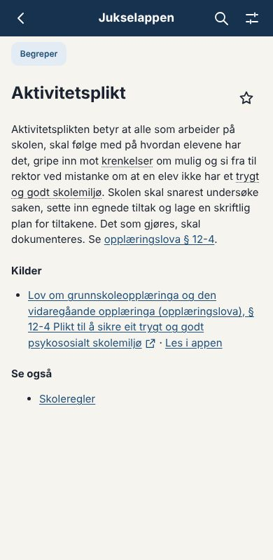 | 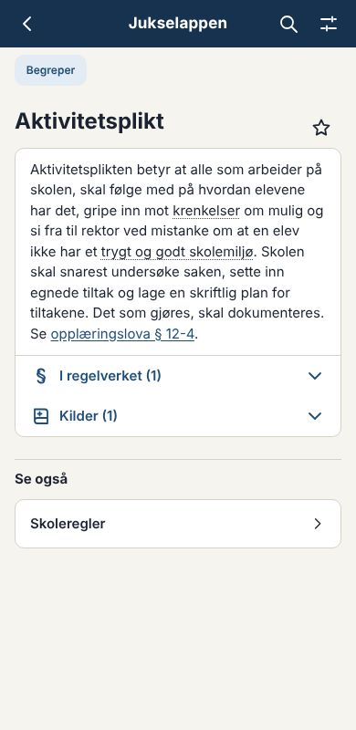 |
| En lov | 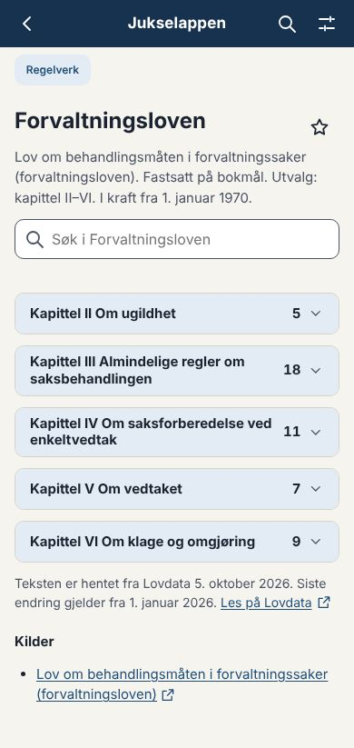 | 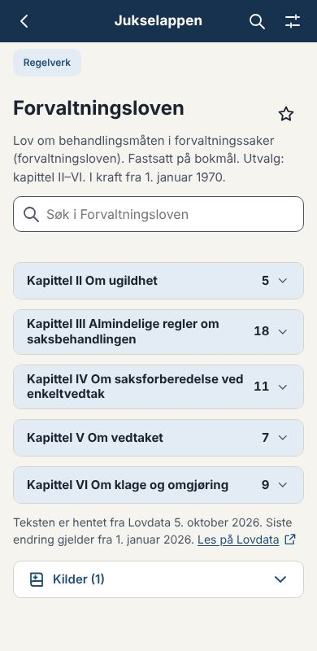 |

---

## Pakke 4: veiviserne (08.10.2026)

- **Stegene:** Steget og tittelen står på en lys flate øverst i kortet, i fargen til veiviseren (blå, rosa, grønn …), som overskriftene på fagarket og i kalkulatorene.
- **Svarene** står som rader i ett hvitt kort med en tynn strek mellom og en pil til høyre, som listene på forsiden. De tykke blå rammene er borte.
- **«Hos fylkeskommunen»** er en lys flate uten tykk strek til venstre.
- Ansvar, dokumentasjon og frist, linjen til venstre med fasene og «Hele prosessen» er som før.

| | Før | Etter |
|---|---|---|
| Første steg | 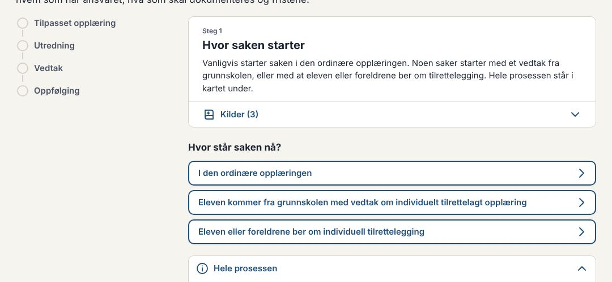 | 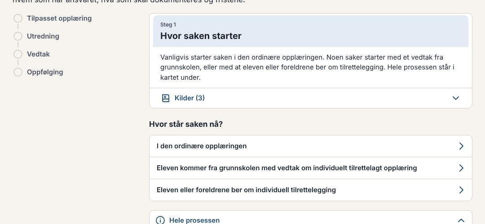 |
| Slutten på en vei | 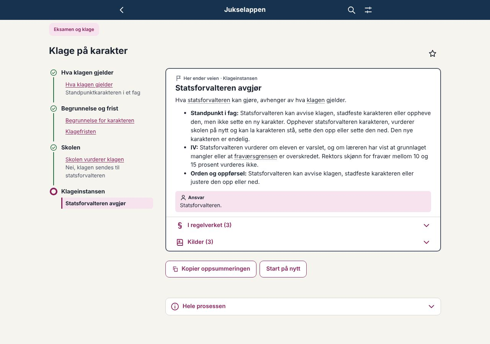 | 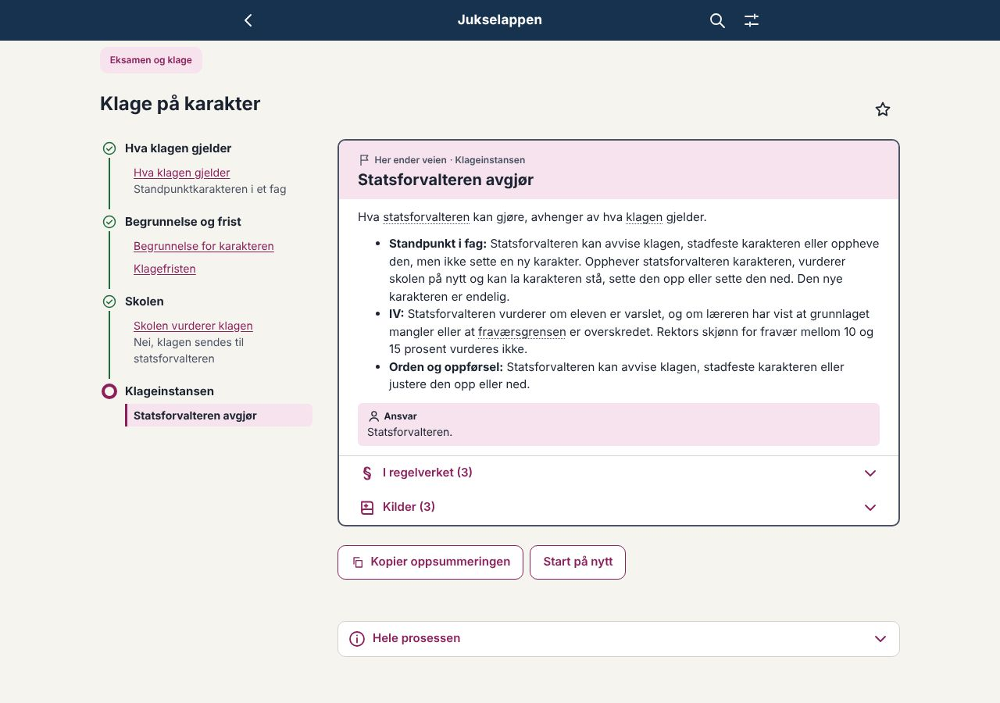 |

---

## Pakke 3: oversiktene i modulene (08.10.2026)

Eier 08.10.2026: kalkulatorene skal ha samme overskrifter som fagarket, og læringen fra pakke 1 og 2 føres videre.

- **Oversiktene** i Vurdering, Tilrettelegging, Eksamen og klage, Opplæringstilbud, Inntak og Aktivitetsplikt og skoleregler står i to kolonner på skrivebord. Sidene i modulen står til venstre. Veiviserne, fristene, kalkulatoren og tallene står til høyre.
- **Rekkefølgen på mobil** følger kolonnene: først venstre, så høyre. I Vurdering står veiviseren derfor nederst på mobil, ikke ved siden av underveis- og sluttvurdering. I Aktivitetsplikt og skoleregler er rekkefølgen som før (retten, veiviseren, skolereglene), så der står skolereglene til høyre.
- **Inngangene** har ikonet i en lys blå sirkel, tittelen i tekstfarge og teksten dempet under, som modulene på forsiden. Delene har en strek over og en fet overskrift.
- **Kort med overskrift:** I kalkulatorene (skjemadelene, resultatet, fordelingen og «Lagrede varianter») og i rubrikkene i Opplæringstilbud, Læreplanverket og Lov og forskrift står overskriften på en lys blå flate. De tykke strekene er borte.
- **Fagtypene i et tilbud** (fellesfag, felles programfag og yrkesfaglig fordypning) har en prikk i samme farge som i stolpen over. Før var streken grå på grunn av en feil i stilene.

| | Etter |
|---|---|
| De seks oversiktene, skrivebord | 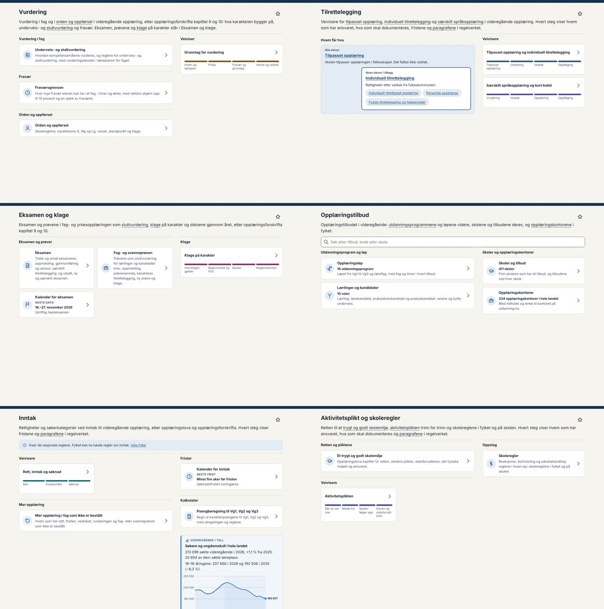 |
| Inntak og Vurdering, mobil | 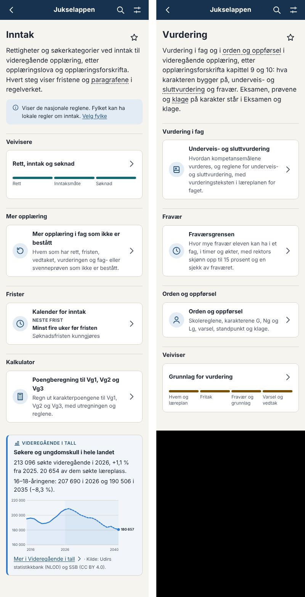 |
| Et tilbud i Opplæringstilbud | 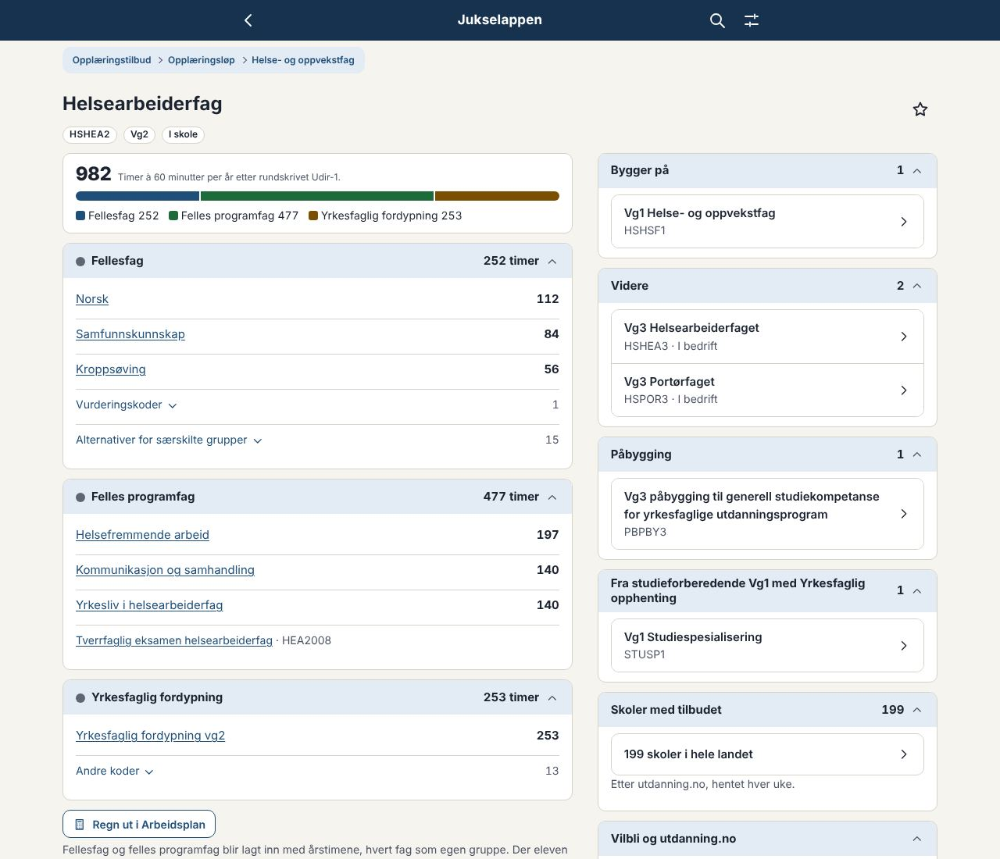 |
| Arbeidsplan med de nye overskriftene | 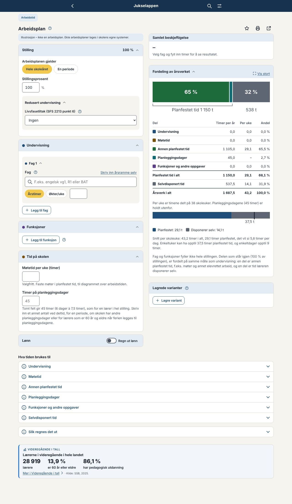 |

---

## Pakke 2: fag og læreplaner (08.10.2026)

Testversjonen: https://jukselappen.no/test/#/fag

- **Fagsøket:** Gruppene (Fellesfag, Felles programfag …) har en tynn strek over og en fet overskrift, uten tykke fargede streker. Fagene i listen har ikke lenger en farget strek til venstre. Fagtypen står fortsatt i farge under navnet («Fellesfag»).
- **Fagarket:**
  - Årstimetallet og årsrammen står med tallet først og stort, side om side med en tynn strek mellom (D5).
  - Delene som kan lukkes, og «Inngår i tilbud», har en strek over, uten ramme (D4).
  - Faktaboksen og boksene under «Vurderingsordning» er hvite kort med tynn kant, ikke blå flater og ikke strek i fargen til fagtypen.
- **Også rettet:** Tallboksene og figurene i Videregående i tall sier «i hele landet» med liten h inni setninger (eier 08.10.2026).

| | Før | Etter |
|---|---|---|
| Fagsøket, skrivebord | 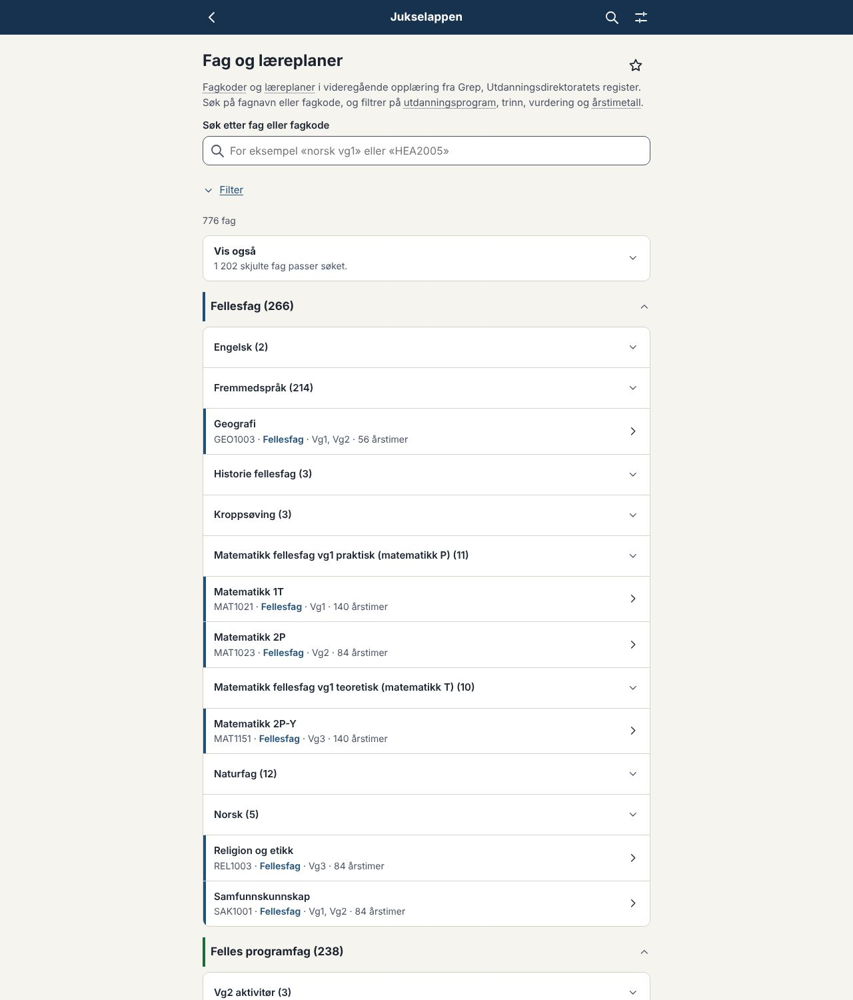 | 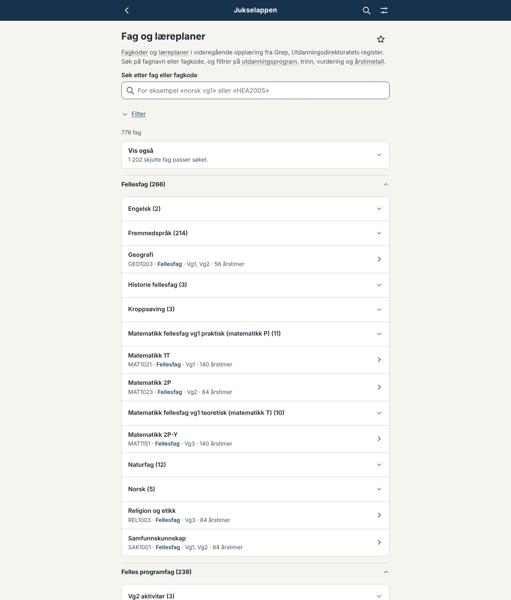 |
| Fagarket, skrivebord | 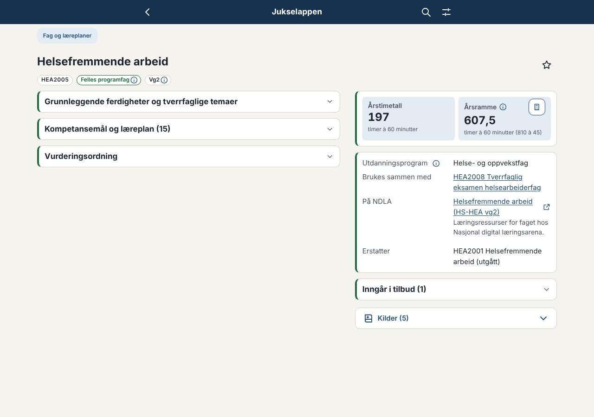 | 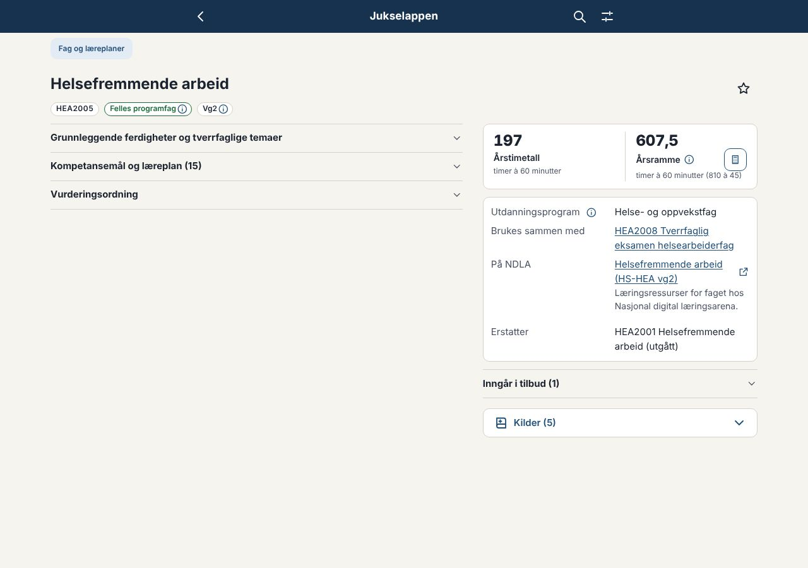 |

**Eiers merknader (08.10.2026):** Uten rammer og farger ble det vanskelig å se forskjell på nivåene. De nyeste sidene bruker bokser og farger med hell. Vurdert på nytt og endret:
- **Fag og faggrupper i fagsøket:** Gruppene av fag (f.eks. «Engelsk (2)») har et ikon i en myk sirkel, og fagene har det ikke. Fagtypene øverst (Fellesfag …) står på en myk blå flate med en prikk i fargen til fagtypen. Når en gruppe er åpen, står fagene i en egen boks under.
- **Kalkulatorknappen ved årsrammen** er flyttet til en blå lenkelinje nederst i kortet med nøkkeltallene, som «Hele kalenderen» på forsiden.
- **Overskrifter og underoverskrifter på fagarket:** Delene er kort igjen, med overskriften på en myk blå flate. Underdelene (f.eks. «Muntlige ferdigheter») er rader med tynn strek inne i kortet. Boksene under «Vurderingsordning» er en grå flate inne i kortet.
- **«Inngår i tilbud»:** Tilbudene er rader med tittel, en linje med kode, trinn og timer, og pil, som fagene i fagsøket.
- **Underveis- og standpunktvurdering:** står inne i kortet med luft over og under, og lenken til læreplanen står under med luft.

| | Etter merknadene |
|---|---|
| Fagsøket, skrivebord | 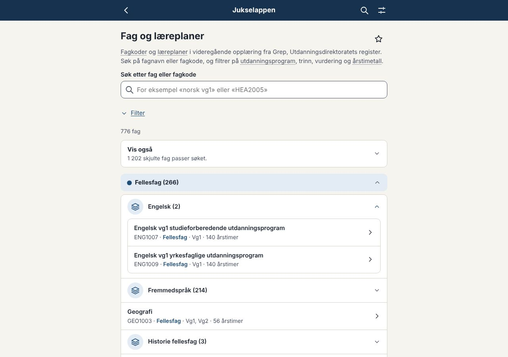 |
| Fagarket, skrivebord | 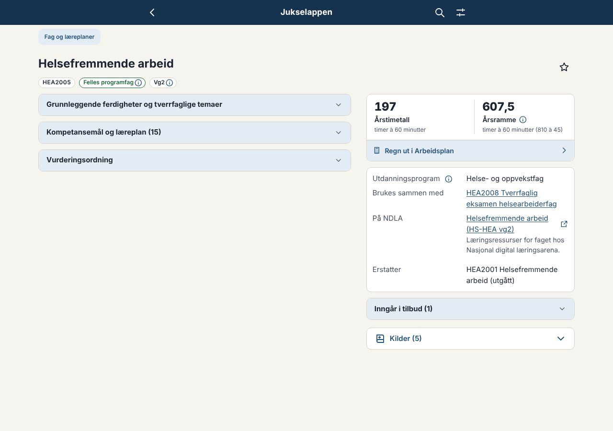 |
| Fagarket med delene åpne, mobil | 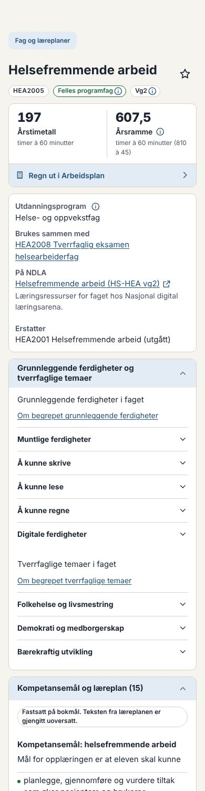 |

---

## Pakke 1: kalkulatorene (08.10.2026)

Testversjonen: https://jukselappen.no/test/ (sammenlign med https://jukselappen.no/).

- **Skjemaet:** hvite kort med tynn kant og titler i tekstfarge. I Arbeidsplan har delene og fagene en prikk i fargen fra diagrammet (D1). «Fag 1» står i kortet, i vanlig skrift.
- **Valgene:** gule piller. Korte valg (høyst sju tegn, f.eks. 45, 60, 90 og Annet) er avrundede firkanter (D2). Det gjelder alle stedene appen har slike valg, også Opplæringstilbud, Kalender og Elevundersøkelsen. Valget i det mørke toppfeltet på forsiden er som før.
- **Resultatet:** et hvitt kort med tynn kant. Før noe er fylt inn, står kortet der med en strek og en linje om hva som må fylles inn (D3).
- **«Lagrede varianter»** står i et kort.
- **Forklaringene** etter hverandre («Hva tiden brukes til», «Slik regnes grensen», «Slik regnes poengene») står i én boks med en tynn strek mellom.

**Eiers merknader (08.10.2026) og hva som er gjort:**
- **1 100 timer planfestet tid** i skjermbildene var en testverdi for Vestland som bare finnes i utviklingsmiljøet (`tests/fixtures/regler/sfs2213-fylke-46.yaml`). Appen bruker 1 150 timer fra regelsettet. Skjermbildene er tatt på nytt uten valgt fylke.
- **«Disponerer læreren selv»:** Teksten er skrevet om to ganger (eier: den første omskrivingen var uoversiktlig). Den vises bare når fag og funksjoner ikke fyller stillingsprosenten, og lyder nå: «Fag og funksjoner fyller ikke hele stillingen. Delen som står igjen (100 % av stillingen), er fordelt på samme måte som undervisning: en del er annen planfestet tid, f.eks. møter og annet elevrettet arbeid, og en del er tid læreren disponerer selv.» Beregningen er ikke endret.
- **Bryterne:** Av/på-bryterne er gule med mørk knott når de er på, som de valgte pillene, i hele appen.

| | Før | Etter |
|---|---|---|
| Arbeidsplan, skrivebord | 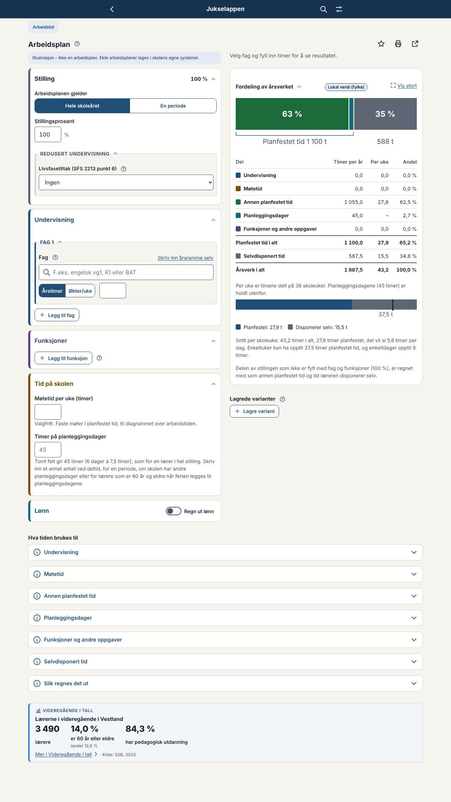 | 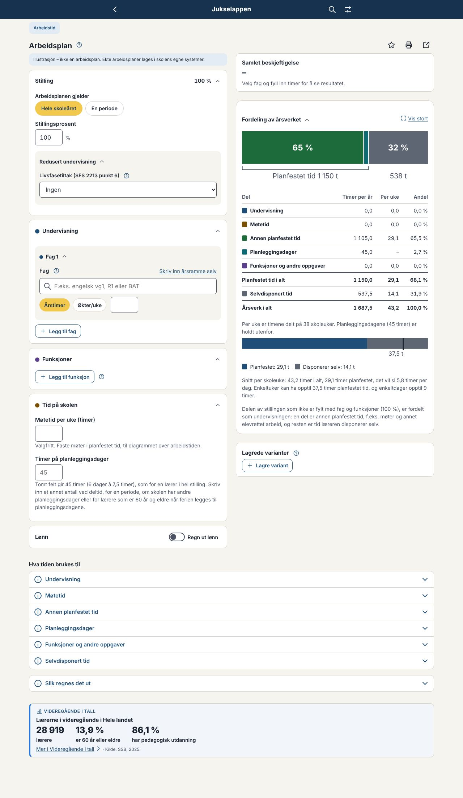 |
| Fraværsgrensen, skrivebord | 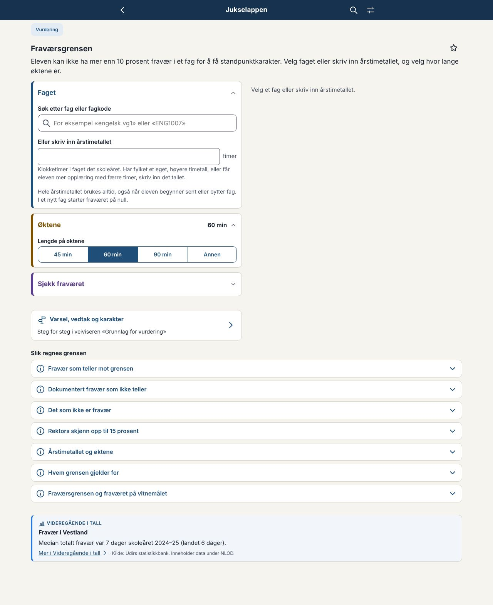 | 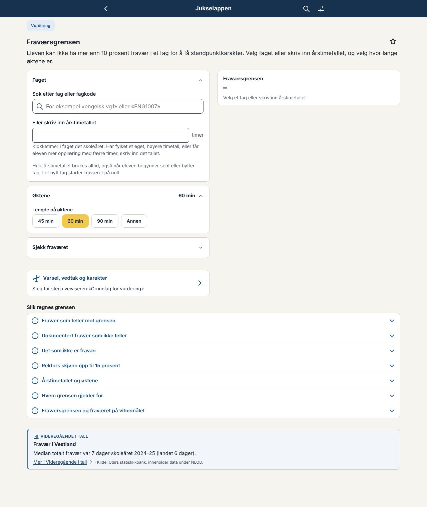 |
| Poengberegning, mobil | 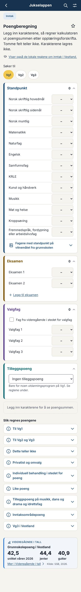 | 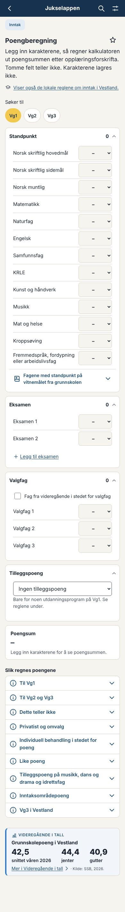 |

---

## Svar på runde 1 (eier 08.10.2026)

> Det nye designet er gjennomgående bedre.

- **D1:** Godtatt. Eier likte at fargene var lette å følge i den eldre versjonen, men det er penere nå.
- **D2:** Fargen og pillene er gode, men 45/60/90 er for runde. **Gjort:** korte valg på én linje i skjemaene (`Bryter kompakt`) er avrundede firkanter.
- **D3:** A. Resultatkortet vises fra start.
- **D4:** Godtatt.
- **D5:** Ja, tallet først også i Videregående i tall. Tas i oppryddingen (pakke 7).

---

## Runde 1: designprinsippene og skissen

**Reglene** står i `docs/DESIGN.md`. De bygger på sidekolonnen på forsiden, Kalender, Nyheter og Videregående i tall.

**Skissen** står i testversjonen: https://jukselappen.no/test/#/utvikling/design
- Hvert mønster har «Før» og «Etter». «Etter» er de samme komponentene som i appen, med de nye stilene.
- **Bryteren øverst** viser kalkulatorene og fagarket i ny stil i hele testversjonen, så du kan se de ekte sidene. Slå den av for å se dem som før.
- Resten av appen er ikke endret ennå. Det kommer i pakkene, etter ditt svar.

**Kort fortalt, det som endres:**
- **Kort:** tynn kant rundt, ingen tykke fargede streker til venstre. Titlene står i tekstfarge, ikke blått, lilla eller brunt.
- **Overskrifter:** «FAG 1» står i kortet i vanlig skrift, ikke med store bokstaver på rammen. Delene på oversiktene får en strek over og en fet overskrift, som på forsiden og temasidene.
- **Valgknapper:** gule piller med luft mellom, som fanene i Videregående i tall, i stedet for mørkeblå blokker.
- **Innganger:** ikonet i en myk sirkel og tittelen i tekstfarge, som modulene på forsiden.
- **Delene som kan lukkes:** som delene på temasidene: strek over, tittel og en liten pil. Ingen ramme og ingen tykk strek.
- **Tall:** tallet først og stort, teksten under. Tynn kant i stedet for den tykke blå rammen rundt resultatet.

| | Før | Etter |
|---|---|---|
| Arbeidsplan, skrivebord |  |  |
| Vikartimer, mobil | 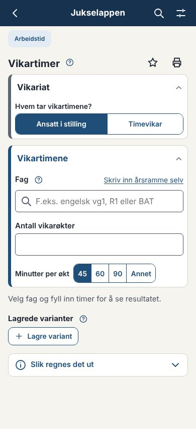 | 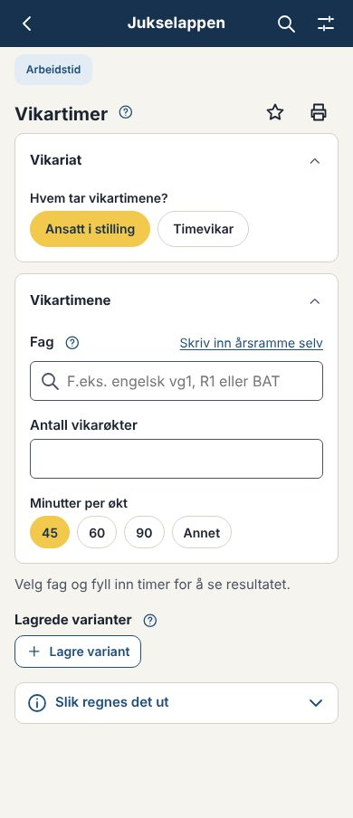 |
| Fagarket, skrivebord | 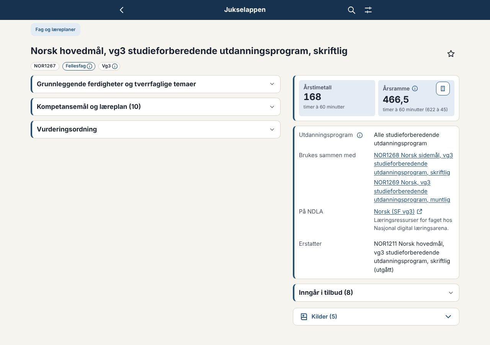 | 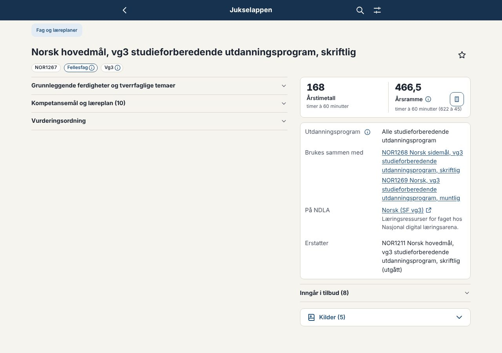 |

Hele skissen: [skrivebord](bilder/fase-8b-skisse-skrivebord.jpg) og [mobil](bilder/fase-8b-skisse-mobil.jpg).

**Spørsmål:**

- **D1 Fargen til delene i Arbeidsplan.** Den tykke streken blir en liten prikk foran tittelen, i samme farge som delen i diagrammet. Prikken står bare i Arbeidsplan, der diagrammet er. I de andre kalkulatorene er det ingen farge. Er det greit?
- **D2 Valgknappene.** Gule piller overalt der brukeren velger mellom noen få ting, også i skjemaene (kalkulatorene, poengberegningen og «Min skole / Alle» i Opplæringstilbud). Er det greit, eller vil du ha en roligere variant i skjemaene (hvit pille med blå kant for det valgte)?
- **D3 Resultatkolonnen i kalkulatorene på skrivebord.** I dag står den tom med en løs tekst til noe er fylt inn.
  - **A (anbefalt):** Resultatkortet står der fra start, med streker («–») der tallene kommer og en kort linje om hva som må fylles inn. Siden hopper ikke når tallene kommer.
  - **B:** Skjemaet bruker hele bredden til noe er fylt inn, og resultatet kommer til høyre etterpå.
- **D4 Delene på fagarket** («Kompetansemål og læreplan», «Vurderingsordning», «Inngår i tilbud»). I skissen er de som delene på temasidene: en strek over, uten ramme. Er det greit, eller vil du ha dem som hvite kort med tynn kant?
- **D5 Nøkkeltallene i Videregående i tall** har teksten over tallet («Søkere 2026», så «25 090»). Resten av appen får tallet først. Skal flisene der også få tallet først (i oppryddingen), eller beholdes de som de er?

**Neste steg etter svaret:** pakke 1, kalkulatorene, med skisse før og etter på `test/`, PR og grønn CI.
