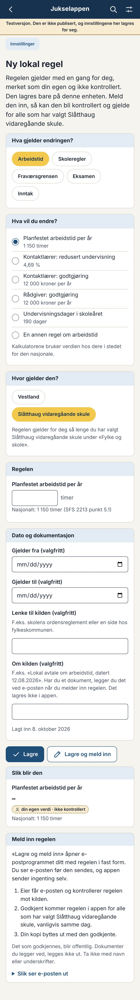
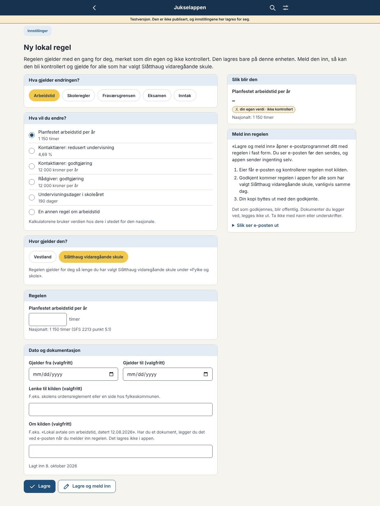
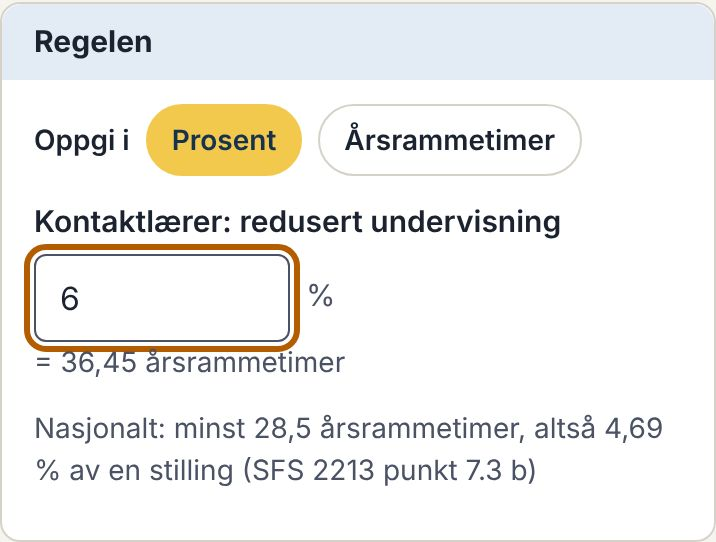
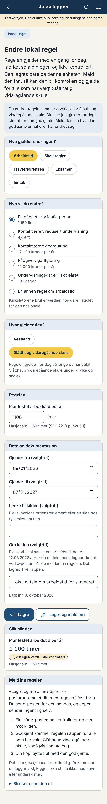
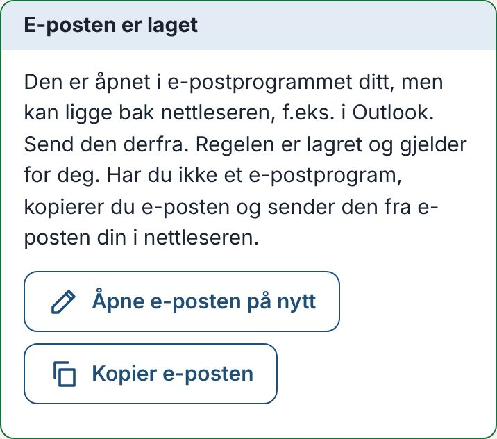
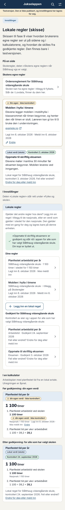
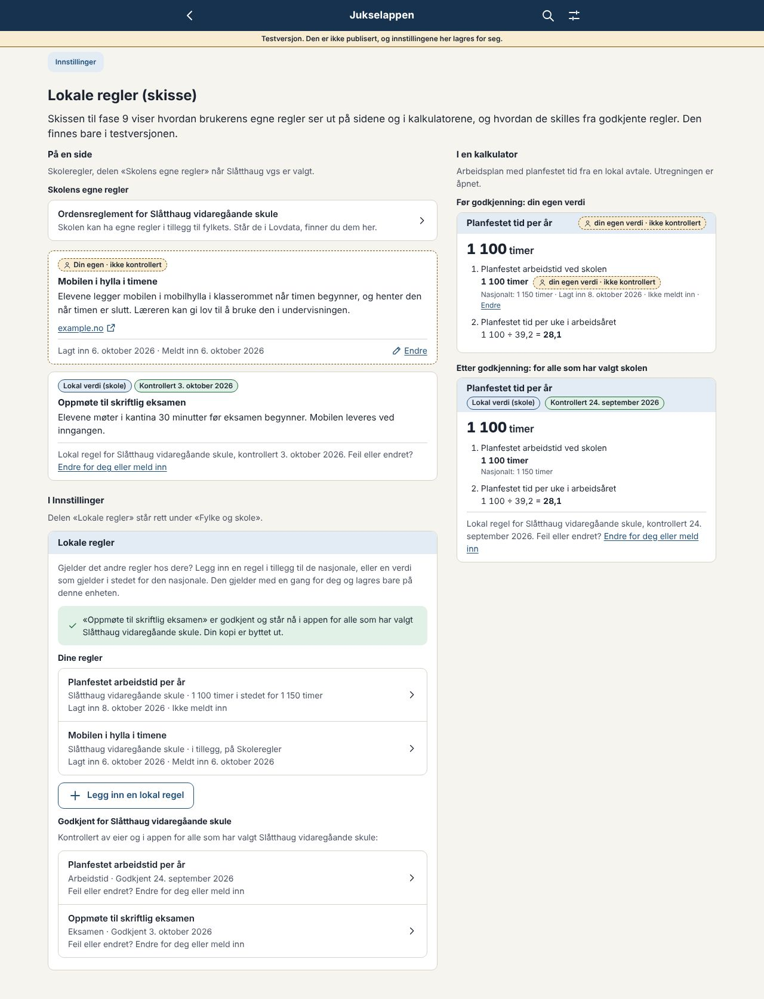
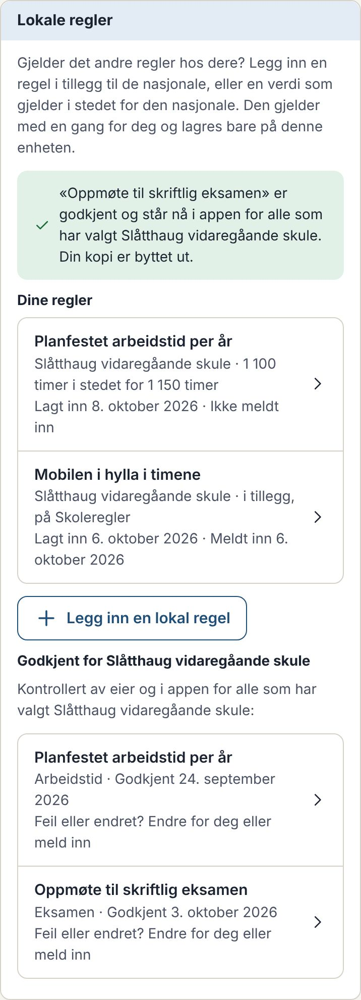
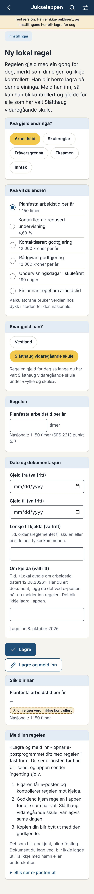

# Forslag: fase 9 – Lokale regler for fylke og skole

Til eier, 08.10.2026. Svar gjerne punkt for punkt (f.eks. «L1 ja, L4 B»). Rundene står med den nyeste øverst.

*Status 08.10.2026:* Eier svarte «L4 B» og godkjente designet etter runde 2 («Ellers fint; kjør publisering!»). Levert i 0.46.0 (avgjørelse 093). Skissen er erstattet av løsningen, og rundene under står som de ble skrevet.

---

## Runde 2: svarene dine og ny skisse (08.10.2026)

**Dine svar:** L1 ja, med en vei til å endre eller melde inn en godkjent regel der den brukes. L2, L3 og L6 ja. L5: godkjenning uten ny versjon. L4: spørsmål (svar under). I tillegg: skjemaet etter tema, funksjoner i prosent, en regel for vedlikehold, og e-posten som havnet bak nettleseren.

### Endret i skissen

- **Tema først:** Skjemaet begynner med «Hva gjelder endringen?» (Arbeidstid, Skoleregler, Fraværsgrensen, Eksamen og Inntak). Så kommer «Hva vil du endre?» med det som kan endres under temaet, med den nasjonale verdien under hvert valg. Under Arbeidstid står de fem verdiene og «En annen regel om arbeidstid». Under de andre temaene er det bare en regel på siden.
- **Funksjoner i prosent:** Redusert undervisning for kontaktlærer oppgis i prosent av en stilling eller i årsrammetimer. Under feltet står omregningen («= 36,45 årsrammetimer») og den nasjonale verdien begge veier: «minst 28,5 årsrammetimer, altså 4,69 % av en stilling». Prosenten er årsrammetimene delt på årsrammen for funksjoner (607,5), som i Arbeidsplan. Valget står på prosent fra start.
- **Feil eller endret?** Under en godkjent regel, på siden og i kalkulatoren, står det hvem den gjelder for og når den ble kontrollert, og «Feil eller endret? Endre for deg eller meld inn». Lenken åpner skjemaet med den godkjente regelen fylt inn. Lagrer du, gjelder din versjon for deg i stedet for den godkjente, merket «Din egen». Melder du den inn, får eier den som en endring av den godkjente (`endrer: LR-2FXB` i e-posten). De godkjente reglene står også i Innstillinger med samme lenke.
- **E-posten:** Etter «Lagre og meld inn» kommer et kort under knappene: «E-posten er laget». Det sier at e-posten kan ligge bak nettleseren (f.eks. i Outlook), at regelen er lagret, og har «Åpne e-posten på nytt» og «Kopier e-posten». Kortet får fokus, så skjermlesere leser det også. Appen kan ikke hente e-postprogrammet fram selv. Det bestemmer operativsystemet.

| | Mobil | Skrivebord |
|---|---|---|
| Skjemaet, tema først |  |  |
| Kontaktlærer i prosent |  | |
| Skoleregler: bare en regel på siden |  | |
| Endre en godkjent regel |  | |
| Etter «Lagre og meld inn» |  | |
| På siden, i kalkulatoren og i Innstillinger |  |  |
| Delen i Innstillinger |  | |
| 320 px, nynorsk |  | |

### L4. Hva det betyr at lokale avtaler som ikke er offentlige, kan godkjennes

Et eksempel: Skolen har en lokal avtale om at planfestet tid er 1 100 timer. Avtalen ligger i personalhåndboka, ikke på nett. En lærer legger inn 1 100 timer og melder det inn, med avtalen som vedlegg i e-posten.

- **A: Bare med offentlig kilde.** Du kan ikke godkjenne regelen, fordi andre ikke kan sjekke kilden. Den blir lærerens egen, og de andre ved skolen ser den ikke.
- **B: Også uten offentlig kilde.** Du leser avtalen i vedlegget og godkjenner. Alle som har valgt skolen, får 1 100 timer i kalkulatorene. Kilden i appen er «Lokal avtale ved Slåtthaug vgs, 12.08.2026 (ikke offentlig)», uten lenke. Avtalen legges ikke ut, men tallet og datoen blir offentlige i appen og i repoet.

Med B er din kontroll det eneste andre kan stole på, og du bør bare godkjenne når du har sett avtalen. Med A får de fleste lokale arbeidstidsavtalene ikke plass.

**Råd:** B, med to vilkår: du har sett dokumentet, og regelen sier ikke mer enn tallet, datoen og hvem avtalen gjelder for.

### L5. Godkjenning uten ny versjon

- Godkjente lokale regler ligger i en egen mappe (`lokale/`), ikke i `content/` og `rules/`. Skjemaet og testene er de samme.
- Ved bygging blir de en egen fil ved siden av appen (`data/lokale/regler.json`), som nyhetene (avgjørelse 084). Appen henter filen når den åpnes, og service workeren tar vare på den, så den virker uten nett. Oppslaget skole → fylke → nasjonal bruker reglene i filen.
- **Godkjenningen:** Du sier «godkjent» til Claude. Claude setter `kontrollert` med datoen og fletter PR-en når CI er grønn. Publiseringen starter av seg selv, uten versjonstag, og tar med `lokale/` fra main. Ingen melding om ny versjon i appen.
- Brukerne ser regelen neste gang de åpner appen, vanligvis samme dag. Den godkjente regelen erstatter kopien til den som meldte den inn.
- Til filen er hentet første gang, bruker kalkulatorene de nasjonale verdiene. Er en lokal regel brukt, står det i resultatet, så det ikke kan gå ubemerket.

**Spørsmål:** Er det greit at publiseringen av lokale regler starter av seg selv når PR-en er flettet, som for nyhetene?

### L7. Vedlikehold: nye sider, funksjoner, kalkulatorer og regler

- **Regelverdier:** Hver verdi i `rules/` som kalkulatorene bruker, får `lokal: true` eller `lokal: false`. En test feiler når en verdi mangler valget. En ny verdi kan derfor ikke legges inn uten at noen har tatt stilling til om den kan variere lokalt.
- **Sider og kalkulatorer:** Hver modul sier i manifestet hvilke tema den har lokale regler for (`lokaleRegler`), eller at den ikke har noen. En test feiler når en ny side eller kalkulator mangler valget. Temaene og valgene i skjemaet bygges fra dette, så de kommer med uten egen kode.
- **AGENTS.md** får en linje under «Legge til noe nytt»: Kan noe nytt variere lokalt (fylke, skole eller lokal avtale), blir det et valg under Lokale regler. Er du i tvil, spør eier.

**Råd:** Som over.

### Videre

Når L4 og L5 er avklart, og du er fornøyd med designet, bygger jeg løsningen ferdig: lagringen, oppslaget, delene på sidene, filen med godkjente regler, publiseringen og testene. Ende-til-ende-testene kommer etter at du har sagt at designet er ferdig.

---

## Runde 1: skisse og seks spørsmål (08.10.2026)

Skissen finnes bare i testversjonen (https://jukselappen.no/test/). Den publiserte appen er uendret. Velg Vestland og en skole under Innstillinger, så står delen «Lokale regler» rett under «Fylke og skole». Reglene i skissen ligger bare i minnet og er borte når siden lastes på nytt. Tre eksempler er lagt inn: en verdi som bare er lagret, en regel som er meldt inn, og en regel som er godkjent.

- `#/innstillinger`: delen «Lokale regler»
- `#/innstillinger/lokal-regel`: skjemaet for en ny regel
- `#/utvikling/lokale-regler`: hvordan reglene ser ut på en side, i en kalkulator og i Innstillinger

### Slik ser det ut

| | Mobil | Skrivebord |
|---|---|---|
| Ny verdi |  |  |
| Regel på en side, med e-posten åpnet |  |  |
| På siden, i kalkulatoren og i Innstillinger |  |  |
| Delen i Innstillinger |  | |
| 320 px, nynorsk |  | |

Datofeltene viser «mm/dd/yyyy» i skjermbildene fordi nettleseren i skymiljøet er engelsk. På telefonen står datoen på norsk.

**Skjemaet** er fire kort med overskriften på en lys flate, som Innstillinger og kalkulatorene:
1. **Hva gjelder regelen?** «Et tall i kalkulatorene» eller «En regel på en side» (gule piller).
2. **Hvor gjelder den?** Fylket eller skolen du har valgt.
3. **Regelen:** For et tall velger du verdien og ser den nasjonale verdien med kilden. For en regel velger du siden den skal stå på, og skriver tittel og regelen med egne ord.
4. **Dato og dokumentasjon:** gjelder fra og til, lenke til kilden og en linje om kilden. Datoen den ble lagt inn, settes av seg selv.

Til høyre (under på mobil) står «Slik blir den» og «Meld inn regelen» med de tre stegene og e-posten slik den blir.

---

### L1. Hva som kan legges inn i første omgang, og hvordan brukeren velger

**To typer, med fast forhold:**
- **Et tall i kalkulatorene** gjelder alltid i stedet for den nasjonale verdien (`erstatter`). I første omgang de fem verdiene der SFS 2213 sier «minimum», eller at partene på skolen kan avtale noe annet, og skoleåret:
  - planfestet arbeidstid per år (punkt 5.1, «med mindre partene på skolen blir enige om noe annet»)
  - redusert årsramme for kontaktlærer (punkt 7.3 b, «minimum»)
  - godtgjøring for kontaktlærer og for rådgiver (punkt 9.1, «minimum»)
  - undervisningsdager i skoleåret (lokal skolerute)

  Verdiene merkes med `lokal: true` i `rules/`, så listen kan utvides uten kodeendring.
- **En regel på en side** kommer alltid i tillegg til de nasjonale (`supplerer`), og står på én av fem sider: Skoleregler, Eksamen, Fraværsgrensen, Arbeidstid og Inntak. Siden får en del for lokale regler der den ikke har en fra før (Skoleregler har «Skolens egne regler»).

**Ikke i første omgang:**
- en regel som erstatter et kort eller en tekst i appen (krever at brukeren velger kortet, og at eier vurderer hva som faller bort)
- steg i en veiviser (stegene henger sammen i en vei, og et nytt steg må passe inn)
- tabellene (årsrammene i vedlegg 1) og tilleggspoengene ved inntak, som står i fylkets forskrift og hentes fra Lovdata

**Råd:** De to typene med fast forhold. Si fra om du vil ha flere verdier eller sider med.

### L2. Hvordan brukerens egne regler vises, og hvordan de skilles fra godkjente

- **Brukerens egen regel** har stiplet kant i ravfarge og merket «Din egen · ikke kontrollert». Nederst står når den ble lagt inn, om den er meldt inn, og «Endre». Den står sammen med de andre lokale reglene på siden.
- **I kalkulatorene** har resultatet og utregningen merket «din egen verdi · ikke kontrollert», og under verdien står den nasjonale verdien og «Endre». Den nasjonale verdien brukes ikke.
- **Godkjent** er regelen et vanlig kort med merket for skolen eller fylket og «Kontrollert {dato}», som annet lokalt innhold. Den har kilden i «Kilder» nederst (`Kortfot`).
- **Teknisk:** Brukerens regler slås opp før skolen (egen → skole → fylke → nasjonal) i `hentVerdi` og `velgSynlige`, så kalkulatorene og sidene bruker dem uten egen kode per modul. Kopien av resultatet fra en kalkulator sier at verdien er brukerens egen.

Ravfargen sier «se opp» uten å si at noe er feil. Gult brukes ikke, fordi gult er det som er valgt.

**Råd:** Som i skissen.

### L3. E-post, GitHub-sak eller begge

- **E-post** (som tilbakemeldingen, avgjørelse 064): «Lagre og meld inn» åpner e-postprogrammet med regelen i fast form (YAML, se skjermbildet), og brukeren kan legge ved dokumentasjon. Ingen konto, og ingenting blir offentlig før du har godkjent det. Brukeren ser e-posten før den sendes.
- **GitHub-sak:** går rett inn i godkjenningen med `/godkjent`, men krever konto, er offentlig fra første stund og kan ha vedlegg med navn i.

**Slik går godkjenningen med e-post:** Du videresender eller limer inn e-posten til Claude i en ny samtale. Claude legger regelen inn med `kontrollert: null` i en PR, skriver den på bokmål og nynorsk, og legger kilden i kilderegisteret. Du ser over PR-en i testversjonen og sier «godkjent». Da setter Claude `kontrollert` med datoen (AGENTS.md: «eller du etter eksplisitt beskjed fra eier, med dato») og fletter.

**Råd:** Bare e-post. Det er ett sted å se etter, og ingenting blir offentlig før du har sagt ja.

### L4. Dokumentasjon med navn eller underskrifter, og lokale avtaler som ikke er offentlige

- **Appen lagrer ikke vedlegg.** Den lagrer en lenke og en linje om kilden. Et dokument legges ved e-posten. Vedlegg i appen ville trengt en egen lagring for filer og gjort kopien under «Dine data» stor, og `mailto:` kan ikke ta med filer.
- **Ingen dokumenter i repoet.** Regelen skrives med egne ord. Navn og underskrifter tas ikke med. E-posten og vedlegget blir i innboksen.
- **Lokale avtaler som ikke er offentlige:**
  - A: Godkjennes bare med en offentlig kilde (skolens nettside, fylkets side, Lovdata). Ellers blir regelen brukerens egen.
  - B: Godkjennes også uten offentlig kilde. Kilden i kilderegisteret blir «Lokal avtale ved {skole}, {dato} (ikke offentlig)», uten lenke og uten kildesjekk. Din kontroll er garantien. Selve avtalen legges ikke ut.

**Råd:** B. Mange lokale arbeidstidsavtaler ligger ikke på nett, og tallene er nyttige for alle ved skolen. Tallet og datoen avslører ikke mer enn avtalen sier.

### L5. Når godkjente regler vises for andre

- **Med neste versjon:** Regelen blir vanlig innhold i `content/` eller en verdi i `rules/`, med tester, søk og dagens jukselapp. Versjonene kommer ofte, og du kan be om en versjon rett etter godkjenningen.
- **Rask publisering** (som nyhetene, avgjørelse 084): reglene i en egen fil som hentes når appen åpnes, uten ny versjon. Det krever at kalkulatorene venter på filen, og reglene kommer ikke med i søket og testene på samme måte.

**Råd:** Med neste versjon. Vi kan ta den raske veien senere hvis det blir mange regler.

### L6. Om datoene er nok

Skissen har fem datoer: **lagt inn** (når brukeren lagret regelen, settes av seg selv), **meldt inn**, **godkjent** (`kontrollert`), og **gjelder fra** og **til** (valgfrie).

- En regel med «gjelder til» som har gått ut, brukes ikke lenger, og står som «utløpt» i Innstillinger, så brukeren kan endre eller slette den.
- En godkjent regel får «Bør kontrolleres på nytt» etter 12 måneder, som annet innhold.

**Råd:** Datoene er nok, med «lagt inn» i tillegg til dem i `OPPDRAG.md`.

---

### Teknisk (til orientering)

- **Lagringen:** Brukerens regler lagres i et valgfritt felt (`egneRegler`) i lagringen. Eldre data kan leses uten migrering, så skjemaversjonen er fortsatt 3. Reglene blir med i «Last ned kopi» og slettes med «Slett alle lokale data».
- **Koden for innmeldingen** (f.eks. `LR-7K3Q`) er tilfeldig og ingen personopplysning. Den godkjente regelen får feltet `innmelding` med samme kode. Ser appen en godkjent regel med koden til en av brukerens egne, byttes kopien ut, og brukeren får beskjed én gang i Innstillinger.
- **Ingen nye avhengigheter.**
- **Startpakken** endres ikke. Skjemaet og stilene lastes med sidene.
