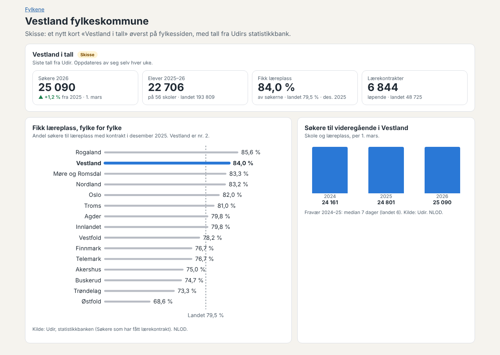

# Forslag: statistikk fra Udir i appen

*Utforsket 06.10.2026 på eiers oppfordring, mens 0.40.0 ble publisert. Ikke bygget. Svar fra eier før noe bygges.*

Målet er å vise at appen er relevant, oppdatert og informativ for den som er interessert i tall, uten å drukne brukeren. Skissen under viser et kort «Vestland i tall» med ekte tall hentet 06.10.2026.

## A. Hva finnes

**1. Udirs statistikkbank: rapport-API-et** (`statistikkportalen.udir.no/api/rapportering/rest/v1`)
- Statistikkbanken på udir.no henter tabellene sine fra dette API-et. Det svarer uten innlogging, med JSON eller CSV, for alle 136 rapportsidene. Rapportsidene, filtrene og standardverdiene kan slås opp med `Rapportside/{kode}`.
- Lisensen er NLOD, og Udir krever kreditering. Appen har det allerede under «Om».
- **Risiko:** Dokumentasjonen sier at API-et «ikke er ment for ekstern bruk i dag, og vil endres uten varsel». Det samme gjelder det åpne API-et som Elevundersøkelsen bruker (avgjørelse 077). Hentingen må derfor stoppe og melde fra når koder eller kolonner endres, og beholde forrige datasett.
- **Det åpne API-et** (`api.statistikkbanken.udir.no`, eksportprefiks «Aapen») har bare de åtte tabellene fra Elevundersøkelsen. Det er sjekket for ID 1–260.

Tall hentet 06.10.2026 (verifisert):

| Tema | Rapportside | Siste periode | Landet | Vestland |
|---|---|---|---|---|
| Søkere, skole og læreplass | `VGO_Soeker_FylkUtdprogAar` | 2026, per 1. mars | 213 096 | 25 090 (24 801 i 2025) |
| Søkere med lærekontrakt | `FOY_SL_Fylker` | desember 2025 (også august og oktober) | 79,5 % | 84,0 %, nr. 2 av 15 |
| Elever og skoler | `VGO_Elev_FylkSkol` | 2025–26 | 193 809 elever på 418 skoler | 22 706 elever på 56 skoler |
| Løpende lærekontrakter | `FOY_LK_FylkUtdprogAar` | 2025 | 48 725 | 6 844 |
| Fravær, median totalfravær | `VGO_fravaer` | 2024–25 | 6 dager | 7 dager |
| Gjennomføring | `VGO_Gjennomfoering_Fylk` | 2019-kullet, målt 2025 | 81,8 % | står på de gamle fylkene (Hordaland og Sogn og Fjordane) |

Statistikkbanken har også karakterer per fag, førsteinntak, overganger, elever som har sluttet, fag- og svennebrev, Lærlingundersøkelsen og lærere. Mange av tabellene har tall per skole (organisasjonsnummer), utdanningsprogram og programområde.

**2. SSB** har tabeller om elever, lærlinger, søkere og gjennomføring per fylke, med åpent API (PxWebApi) og CC BY 4.0. Fra dette miljøet er SSB stengt av proxyen, så tabellene er ikke prøvd. SSB har ikke tall per skole. SSB passer best til gjennomføring for de nåværende fylkene, f.eks. tabell 14863.

**3. Nasjonalt skoleregister** har feltet `Elevtall`, men det var tomt for alle de videregående skolene som ble sjekket. Elevtallet bør hentes fra statistikkbanken.

## B. Forslag til bruk

Grunntanken: få tall, alltid med sammenligning (landet, året før) og kilde, og der brukeren allerede er.

1. **«Fylket i tall» på fylkessiden** (skissen):
   - Fire nøkkeltall: søkere, elever og skoler, andelen som fikk læreplass og lærekontrakter.
   - Én figur: fylkene rangert på andelen som fikk læreplass, med fylket markert og landet som strek.
   - Lukket under en overskrift på mobil og åpen på skrivebord, som de andre delene på fylkessiden.
2. **Ett tall der det hører hjemme**, som en liten boks med lenke til fylkessiden:
   - Inntak: søkere i år mot i fjor.
   - Lærlinger og kandidater: andelen som fikk læreplass.
   - Fraværsgrensen: median fravær i fylket og på skolen.
   - Eksamen: gjennomsnittlig eksamenskarakter i de største fagene.
   - Skolemiljø har allerede Elevundersøkelsen.
3. **Valgt skole:** På skolesiden i Opplæringstilbud står skolens egne tall: elevtall, fravær, og Elevundersøkelsen (lenke til sammenligningen). Det gjør at appen kjenner skolen brukeren arbeider på.
4. **Seinere, hvis tallene blir brukt:** en egen side «Videregående i tall» under Oppslag. Den kan ha søkere per utdanningsprogram over tid, formidlingen gjennom høsten (august, oktober og desember) og gjennomføring, med samme valg av fylke og eierform som Elevundersøkelsen.

**Visning:** samme metode som Elevundersøkelsen.
- Nøkkeltall har sammenligning.
- Liggende stolper fra null.
- Valgt fylke eller skole er markert med farge, og de andre er grå.
- Tabellvisning.
- Ingen nye farger utenfor `tokens.css`.

**Henting:** ett skript, `npm run hent:statistikk`, i kildesjekken hver uke.
- Det henter noen få rapportsider til `data/statistikk/` (anslag under 100 kB).
- Det validerer og lager en endringsrapport.
- Dataene tas med ved publisering, som Elevundersøkelsen.
- Hver tabell blir en egen kilde i kilderegisteret.

## C. Spørsmål til eier

1. Kan appen bruke rapport-API-et til Udir, som Udir sier ikke er ment for ekstern bruk, når hentingen stopper og melder fra ved endringer? Eller skal vi først be Udir om å legge tabellene i det åpne API-et?
2. Hvilke av forslagene B1–B4 skal tas, og i hvilken fase?
3. Gjennomføring per fylke: Skal tallene fra Udir vises for de gamle fylkene, eller skal de hentes fra SSB for de nåværende fylkene?

## D. Eiers svar og skissen i appen (07.10.2026)

**Svar fra eier:**
1. Bruk Udirs API.
2. Eier vil se skisser av alle forslagene, helst nå eller i samme pakke som nyhetene.
3. Gjennomføring: oppklar og avklar (se under).

**Skissen** ligger på testsiden. Alle tallene er ekte og hentet fra statistikkbanken 07.10.2026:
- **B1** på fylkessiden: fire nøkkeltall, fylkets plass blant fylkene og lenke til B4. Rangeringen av alle fylkene står bare på B4, så fylkessiden ikke blir lang.
- **B2:**
  - Inntak: søkere i fylket, endringen fra i fjor og hvor mange som søkte læreplass.
  - Lærlinger og kandidater: andelen som fikk læreplass og løpende kontrakter.
  - Fraværsgrensen: median fravær i fylket, landet og på valgt skole.
  - Eksamen: snittkarakter i sju fellesfag, fylket mot landet.
- **B3** i skolekortet under Skoler og tilbud: elevtall med endring, median fravær og lenke til Elevundersøkelsen for skolen.
- **B4** som egen side, `#/statistikk`:
  - valg av fylke og nøkkeltall
  - søkere per utdanningsprogram mot i fjor, og fylkene side om side i en tabell
  - fylkene rangert på læreplass, og læreplass gjennom høsten
  - gjennomføring, fag- og svennebrev, fravær og eksamen
- **Henting:** én kilde i kilderegisteret (`udir-statistikkbanken`) i stedet for én per tabell, siden alle tabellene kommer fra samme statistikkbank. Se avgjørelse 080.

**Gjennomføring per fylke, oppklart:**
- Udir har gjennomføring på fem/seks år til og med kullet som startet i 2019. Tallene er fordelt på fylkene slik de var før 2020, med teller og nevner.
- Appen regner om til dagens fylker ved å legge sammen teller og nevner for de gamle fylkene. Hordaland og Sogn og Fjordane blir for eksempel Vestland. Det blir nøyaktig for hele fylker. Noen få kommuner byttet fylke i 2020 og 2024 (f.eks. Jevnaker, Lunner og Svelvik). Elevene der telles i det gamle fylket, så avviket er lite.
- **Problemet kommer med kullet fra 2020.** Udir vil fordele det på fylkene fra 2020 til 2023 (Viken, Vestfold og Telemark, Troms og Finnmark). Disse kan ikke deles opp igjen, så sju av dagens fylker vil mangle tall. Fag- og svennebrev viser det allerede: for kullet fra 2020 har bare åtte fylker tall, og appen skriver at tallene mangler for de andre.
- **Anbefaling:** Bruk Udir og omregningen så lenge den går. Når kullet fra 2020 kommer, prøver vi SSB-tabellen med dagens fylker (f.eks. 14863) for de sju fylkene. SSB kan ikke nås fra dette miljøet, men kan nås fra GitHub Actions. Det må prøves der før vi velger.
