# Forslag: grafikken i kalkulatorene og vurderingen

Til eier, 09.10.2026. Svar gjerne punkt for punkt (f.eks. «G1 ja, G3 A»).

**Ønsket ditt:** Vurder farger, oppløsning, utseende og proporsjoner i grafikken i kalkulatorene, først og fremst i Arbeidstid, og i Underveis- og sluttvurdering og andre grafikker som er eldre enn Videregående i tall.

**Skissen** ligger i testversjonen: https://jukselappen.no/test/. Grafikken i disse er endret: Arbeidsplan, Beskjeftigelse, Vikartimer, Overtid, Underveis- og sluttvurdering og Elevundersøkelsen. Resten av appen er som før. Skissen regner og lagrer som appen.

## Hva jeg fant

Jeg har sammenlignet grafikken med figurene i Videregående i tall. Fargene er sjekket med en validator for fargesvakt syn og kontrast.

1. **Proporsjonene:**
   - Stolpene er bilder (SVG) som skaleres med bredden.
   - På skrivebord blir årsverket over dobbelt så høyt som på mobil, og tekstene i figuren blir større enn teksten ellers.
   - På mobil er «80 %» under stolpen bare omtrent 11 piksler høy.
   - Det er dette som gjør at grafikken ser ujevn og litt uskarp ut.
2. **Fargene:**
   - Fargene i årsverket er mørke og tunge, i store blokker.
   - Grønn og brun er for like for fargesvakt syn.
   - Grønn og turkis er for like også for normalt syn.
3. **Fargene betyr ulike ting på samme side:**
   - I stolpen for beskjeftigelse er fag 2 grønn. I årsverket rett under betyr grønn «Annen planfestet tid».
   - Fag 4 er grå, som betyr «Selvdisponert tid» i årsverket.
4. **Tallene inni årsverket** gjentar tabellen rett under. Hvit tekst har for lav kontrast på flere av fargene.
5. **Beløpsstolpen** (lønn i Arbeidsplan): Fargen følger rekkefølgen, så variabel lønn bytter farge når tillegget faller bort.
6. **Tidslinjen i Underveis- og sluttvurdering:**
   - Feltene er tykke.
   - Etikettene står i farget tekst.
   - Standpunkt er brun.
7. **Elevundersøkelsen:** Punktene for de tre seriene ligger oppå hverandre, så sirkelen ser ut som en halvsirkel. Dette er en feil.
8. **Kapittel 12** (delpliktene og gangen hos statsforvalteren) og **«Hvem får hva»** i Tilrettelegging er skjemaer, ikke diagrammer. De ser ryddige ut, og jeg foreslår ingen endring der.

### I dag

| Beskjeftigelse | Årsverket | Årsverket på skrivebord |
|---|---|---|
| 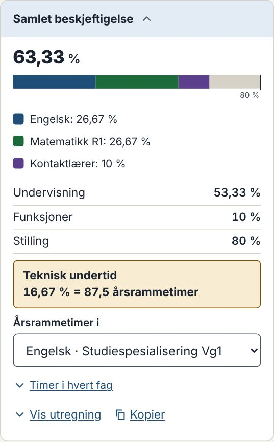 | 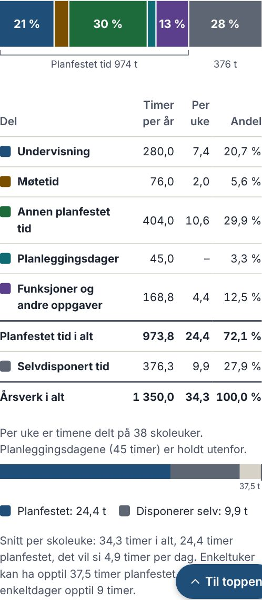 | 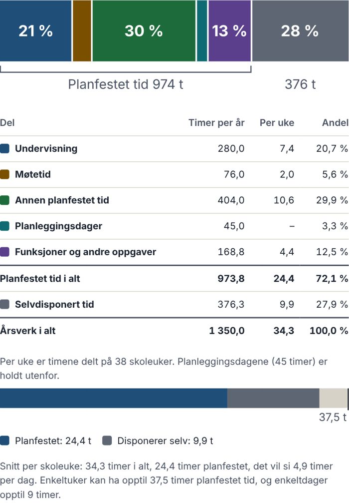 |

| Skoleåret i Vurdering | Elevundersøkelsen (forstørret) |
|---|---|
| 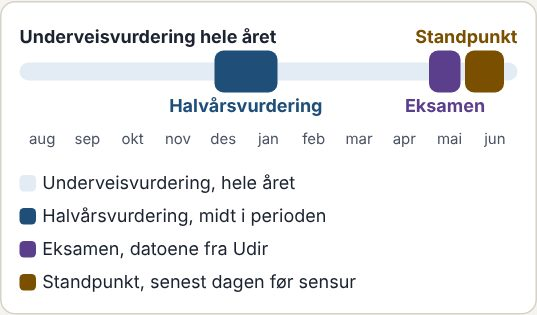 | 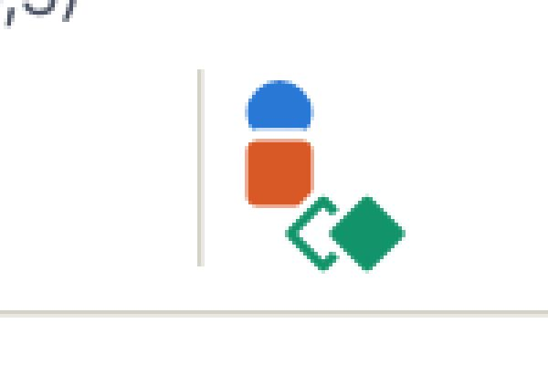 |

### Forslaget

| Beskjeftigelse | Årsverket | Årsverket på skrivebord | Mørk visning |
|---|---|---|---|
| 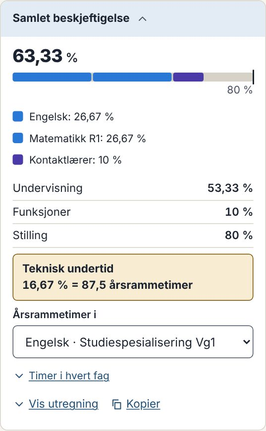 | 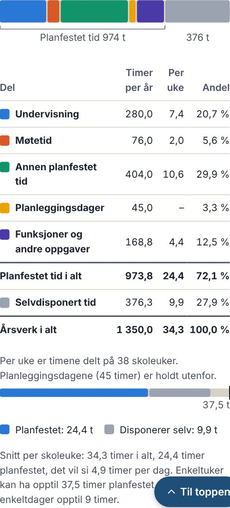 | 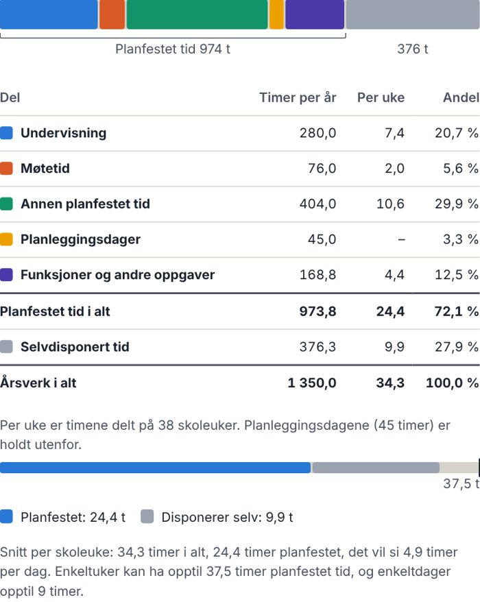 | 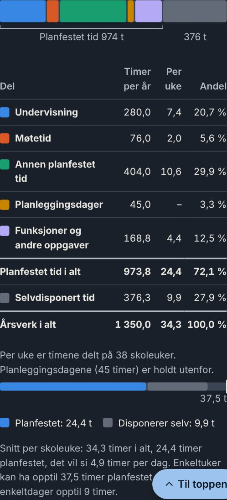 |

| Skoleåret | Skoleåret, mørk | Elevundersøkelsen |
|---|---|---|
| 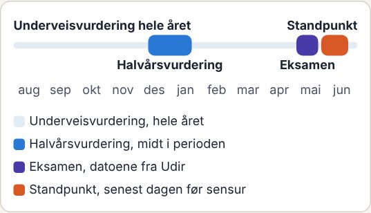 | 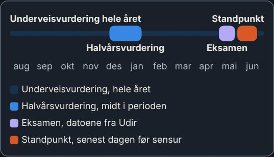 | 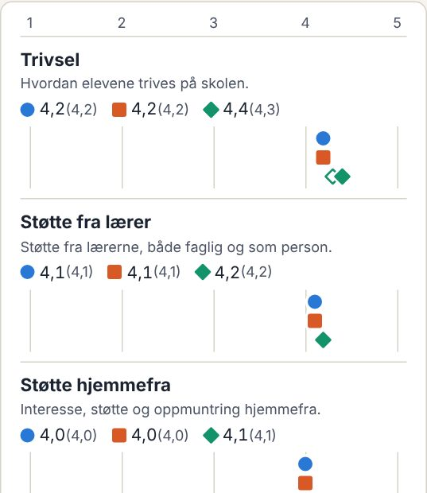 |

### G1. Én felles stolpe

Alle stolpene i kalkulatorene blir én felles stolpe, laget på samme måte som figurene i Videregående i tall:
- **Samme høyde overalt:** Stolpen er like høy på mobil og skrivebord. Målerne er 12 piksler høye, og årsverket 32.
- **Mellomrom:** Det er 2 piksler mellom delene, og hjørnene er avrundet.
- **Tekst:** Tekstene står i vanlig tekststørrelse og tekstfarge, for eksempel «80 %» og «37,5 t» ved streken.
- **Gjelder:**
  - Arbeidsplan: beskjeftigelse, perioden, lønn og uka.
  - Beskjeftigelse.
  - Vikartimer.
  - Overtid.

**Råd:** Ja.

### G2. Fargene

Fargene blir de samme som i Elevundersøkelsen, fra den samme paletten:

| Del | Farge |
|---|---|
| Undervisning | blå |
| Møtetid | oransje |
| Annen planfestet tid | grønn |
| Planleggingsdager | gul |
| Funksjoner | fiolett |
| Selvdisponert tid | lys grå |

Fargene er lysere og klarere enn i dag. Rekkefølgen består sjekken for fargesvakt syn og kontrast, i både lys og mørk visning.

Fargene på fagtypene, i kalenderen og i veiviserne er ikke endret.

**Råd:** Ja.

### G3. Fag og funksjoner i stolpen for beskjeftigelse

- **A:** Alle fag er blå, fordi de er undervisning, og funksjonene er fiolette, som i årsverket.
  - Fagene skilles med mellomrommet og står med navn i forklaringen under.
  - Prikken i fagkortene blir blå for alle fag.
  - Dette er i skissen.
- **B:** Hvert fag har sin egen farge, som i dag, men fra den nye paletten. Da betyr fargene fortsatt noe annet enn i årsverket.

**Råd:** A. Fargen betyr da det samme overalt på siden.

### G4. Årsverket uten tall inni stolpen

Prosentene står i tabellen rett under, som også er fargeforklaringen. Under stolpen står «Planfestet tid 974 t» og tiden læreren disponerer selv, i vanlig tekst.

**Råd:** Ja. Stolpen blir roligere, og tallene står ett sted.

### G5. Faste farger i beløpsstolpen

Lønn, tillegg, variabel lønn, overtid og feriepenger har hver sin faste farge. En del beholder fargen når en annen faller bort.

**Råd:** Ja.

### G6. Tidslinjen for skoleåret

- Sporet for underveisvurderingen er tynnere, og feltene er lavere.
- Etikettene står i tekstfarge, og fargen står i feltet og i forklaringen.
- Halvårsvurdering er blå, eksamen fiolett og standpunkt oransje i stedet for brun.
- Månedene står i litt større skrift.

**Råd:** Ja.

### G7. Elevundersøkelsen

Seriene står på hver sin linje med litt mer luft, så merkene ikke dekker hverandre. Dette er en feilretting.

**Råd:** Ja.

### Videre

Når du har svart, retter jeg skissen etter svarene, med tester. Endringen kan komme i en ny versjon, for eksempel 1.1.0, sammen med at «Legg til fag» og «Legg til funksjon» lukker kortene som står fra før.
