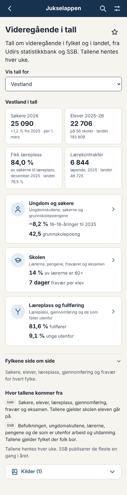
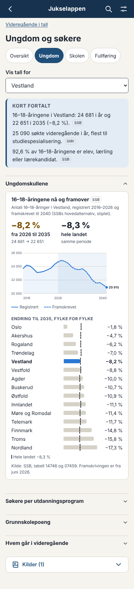
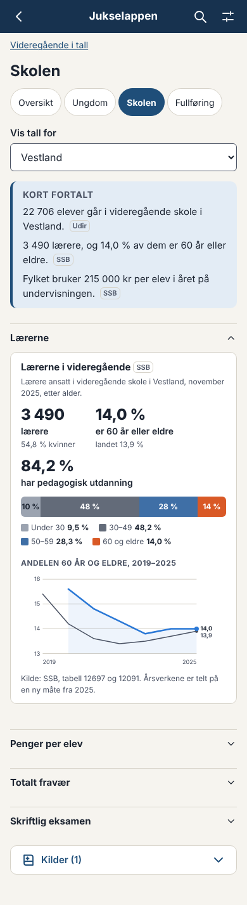
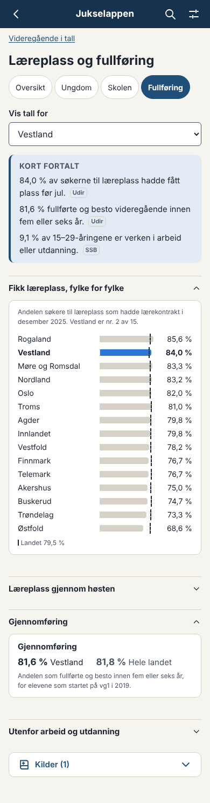
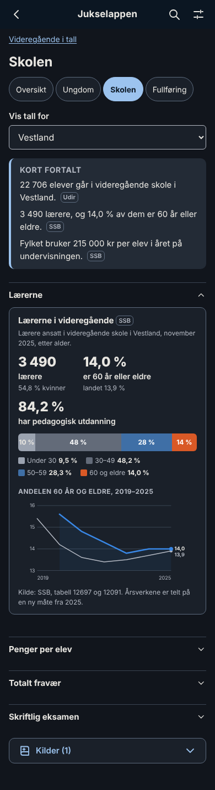
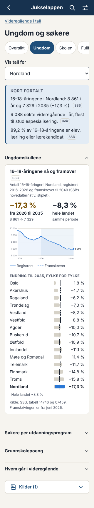
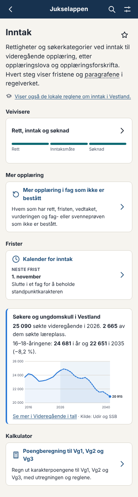
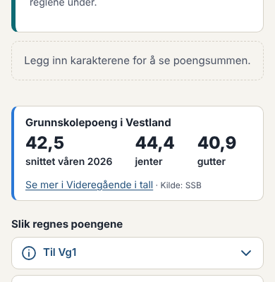
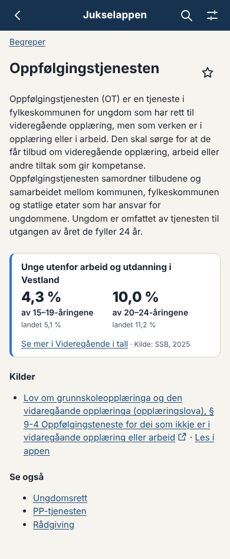

# Forslag: tall fra SSB i Videregående i tall og i appen (skisse 08.10.2026)

> **Gjennomført 08.10.2026** med eiers endringer: temakortene skilt fra nøkkeltallene, «Kort fortalt» med tallet først, fylkestabellen alltid åpen, ingen boble for oversikten på temasidene, SSB i kildeboksen, deltakelsen etter bakgrunn som et valg, lærerne på Arbeidsplan og en felles regel for tallboksene. Se avgjørelse 090 og 091. Skjermbildene under er fra skissen.

Skissen ligger på grenen `claude/wonderful-noether-ikh4wl` og er lagt ut på `test/`, men er ikke flettet inn i `main`. Tallene i skissen ble hentet fra SSBs API (PxWebApi v2) 08.10.2026 og ligger i én fil. Tekstene er skrevet rett i koden og bare på bokmål. I den ferdige løsningen hentes tallene av et skript, og tekstene flyttes til `src/strings` på bokmål og nynorsk.

## Kort fortalt

- **Seks datasett fra SSB** utfyller Udir der Udir ikke har tall:
  1. Ungdomskullene framover
  2. Unge utenfor arbeid og utdanning (NEET)
  3. Grunnskolepoeng
  4. Penger per elev (KOSTRA)
  5. Lærerne
  6. Hvem som går i videregående
- **Videregående i tall blir en oversikt og tre temasider.** Tallene fra Udir og SSB står sammen der de handler om det samme. Hver temaside har en ramme «Kort fortalt» med tre setninger, slik at siden svarer før brukeren ser på figurene.
- **Tre små bokser** står der tallene er nyttige i arbeidet:
  - på Inntak, der søkerne og ungdomskullene står i én boks
  - på Poengberegning, med grunnskolepoengene
  - på begrepet Oppfølgingstjenesten, med andelen unge som er utenfor arbeid og utdanning
- Det trengs **ingen nye avhengigheter**. Figurene er tegnet i SVG og CSS med fargene i `tokens.css`.

## Sidene

| Side | Udir | SSB |
|---|---|---|
| **Oversikt** (`#/statistikk`) | Fire nøkkeltall og tabellen «Fylkene side om side» | Ett tall på hvert temakort |
| **Ungdom og søkere** (`#/statistikk/ungdom`) | Søkere per utdanningsprogram | 1 Ungdomskullene · 3 Grunnskolepoeng · 6 Hvem går i videregående |
| **Skolen** (`#/statistikk/skolen`) | Fravær og eksamen | 5 Lærerne · 4 Penger per elev |
| **Læreplass og fullføring** (`#/statistikk/fullforing`) | Fikk læreplass, læreplass gjennom høsten og gjennomføring | 2 Unge utenfor |

Hver temaside har sti tilbake til oversikten, faner mellom temaene og samme fylkesvalg som oversikten (`?fylke=46` følger med).

### Slik unngår skissen at sidene blir for fulle

- **Oversikten blir kortere.** Den har fire nøkkeltall og tre temakort. Fylkestabellen og en kort tekst om hvor tallene kommer fra står under. De detaljerte figurene ligger på temasidene.
- **Øverst på hver temaside står «Kort fortalt»:** tre setninger, hver med kilden som et lite merke (Udir eller SSB). Mange brukere trenger ikke mer.
- **Én figur svarer på ett spørsmål.** Hver figur har tittel, én setning om hva den viser, ett eller tre store tall og så selve figuren. Kilden står på en liten linje nederst i figuren.
- **Delene kan lukkes, som i dag.** På mobil er den første delen åpen og resten lukket. På skrivebord er alt åpent i to kolonner.
- **Fargene har bare to roller.** Det valgte fylket har seriefargen, og de andre fylkene er grå. Landet er en stiplet strek. Brukeren finner fylket sitt med en gang.
- **Alle tall står også som tekst.** Figurene er pynt for den som ser dem. Teksten er det skjermleseren leser.

### Hvordan tallene vises

| | Figur | Hvorfor |
|---|---|---|
| 1 Ungdomskullene | Linje 2016–2040 der framskrivingen er stiplet og har lysere flate. Endringen til 2035 vises som stolper fylke for fylke. | Viser forskjellen på registrert og framskrevet. Stolpene viser hvor nedgangen er størst. |
| 2 Unge utenfor | Linje for fylket mot landet 2015–2025, og stolper etter alder | Utviklingen over tid og hvilke aldersgrupper det gjelder |
| 3 Grunnskolepoeng | Store tall for alle, jenter og gutter. Fylkene vises som punkter på en skala fra 40 til 45,5. | Forskjellene er små. En skala som ikke starter på null, viser dem uten å overdrive. |
| 4 Penger per elev | To store tall (kr per elev og elever per lærerårsverk) og fylkene rangert | Rangering er det brukerne spør om |
| 5 Lærerne | Alder som én stablet stolpe der 60 år og eldre er fremhevet, og linje for andelen 60+ | Viser hvor mange som snart går av |
| 6 Hvem går i vgo | Ett stort tall og to stolper: med innvandringsbakgrunn og alle andre | Enkelt og tydelig |

## Der tallene hører hjemme

- **Inntak:** Søkerboksen fra Udir og ungdomskullene fra SSB er slått sammen til «Søkere og ungdomskull i Vestland». Tallene leses sammen: hvor mange som søkte i år, og hvor mange 16–18-åringer det blir.
- **Poengberegning:** Grunnskolepoengene i fylket (snitt, jenter og gutter) står under kalkulatoren.
- **Begrepet Oppfølgingstjenesten:** Andelen 15–19 og 20–24 år som er utenfor arbeid og utdanning, med landet under. Det er aldersgruppene tjenesten har ansvar for.
- **Senere, foreslått og ikke skissert:**
  - Lærerne i fylket på fylkessiden
  - En SSB-kolonne i «Fylkene side om side» (grunnskolepoeng, unge utenfor, 60+, kr per elev), som kan velges på mobil som de andre kolonnene
  - Ett SSB-faktum i dagens jukselapp, f.eks. at 14 % av lærerne er 60 år eller eldre

## Henting, lesing og lisens

- **Skript:** `scripts/hent-ssb.ts` lager `data/statistikk/ssb.json`, som får et skjema i Zod, som Udir-dataene.
  - Skriptet kjøres i den ukentlige statistikkjobben og lager en endringsrapport.
  - Appen gjør ingen kall til SSB.
  - Det blir om lag 15 kall per kjøring, med pause mellom hvert. SSB tillater 30 kall i minuttet.
- **Tabeller:**
  - 14746 og 07459 (ungdomskull)
  - 13556 og 13563 (unge utenfor)
  - 07495 (grunnskolepoeng)
  - 12399 og 12609 (KOSTRA)
  - 12697 og 12091 (lærere)
  - 12274 og 09382 (deltakelse)
- **Teknikk:**
  - Kodelisten `agg_KommFylker` gir sammenhengende serier for dagens fylker der SSB har den.
  - `+` i koder må skrives `%2B`.
  - KOSTRA bruker egne regionkoder (`3100`, `EAFK`).
- **Lisens:** CC BY 4.0. Appen krediterer «Statistisk sentralbyrå (SSB)» under «Om», med lenke til lisensen. Hver figur har kilden og tabellnummeret.
  - Den nye kilden `ssb-statistikkbanken` får `godkjent: null` til du godkjenner den (avgjørelse 089).
  - Kilden `ssb-fylkesinndeling` står med NLOD i kilderegisteret. SSB bruker nå CC BY 4.0.

## Fallgruver

- **Ungdomskull:** Framskrivingen er SSBs hovedalternativ og kan bli justert neste gang SSB lager en ny.
- **Unge utenfor:** Tallene for 2025 er foreløpige. Det er et brudd i serien fra 2020 til 2021. Tallene gjelder fylket der de unge bor, ikke fylket der skolen ligger.
- **Grunnskolepoeng:**
  - Tallene for 2020–2022 bygger bare på standpunkt.
  - De nye fylkene har tall bare fra 2024.
  - Det er ikke avklart om tallene gjelder fylket skolen ligger i eller fylket eleven bor i.
- **KOSTRA:**
  - Tallene for 2025 kan bli justert i juni.
  - SSB oppgir feil enhet for per-elev-tallet i tabell 12609 («1000 kr», men verdien er kroner). Skriptet må kontrollere tallet mot 12399.
- **Lærerne:** Årsverkene ble telt på en ny måte fra 2025.

## Spørsmål til deg

1. Er oversikten med tre temasider riktig, eller vil du ha færre (f.eks. bare SSB-delene på eksisterende sider)?
2. Vil du ha «Kort fortalt» øverst på temasidene?
3. Stemmer stedene for boksene (Inntak, Poengberegning og Oppfølgingstjenesten)? Er det andre sider der tallene hører hjemme, f.eks. Arbeidstid for lærerne?
4. Skal penger per elev være med? Det er tall som lett blir lest som en vurdering av fylket.
5. Skal «Hvem går i videregående» vise innvandringsbakgrunn? Det er nyttig, men tema og ordvalg må være presise.
6. Godkjenner du SSB som kilde, og at `ssb-fylkesinndeling` får lisensen CC BY 4.0?

## Skjermbilder

| | |
|---|---|
| Oversikten, mobil  | Ungdom og søkere, mobil  |
| Skolen, mobil  | Læreplass og fullføring, mobil  |
| Skolen, mørk  | Ungdom og søkere, 320 px, Nordland  |
| Inntak  | Poengberegning (utsnitt)  |
| Oppfølgingstjenesten  | |

Skrivebord: [oversikten](ssb/d-hub.png), [ungdom og søkere](ssb/d-ungdom.png), [skolen](ssb/d-skolen.png) og [læreplass og fullføring](ssb/d-fullforing.png).
